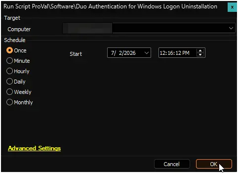

## Summary

This script uninstalls **Duo Authentication for Windows Logon** from a Windows machine and deletes the companion **[Duo Authentication for Windows Logon Version Check](/docs/b75e9b1e-2035-4d68-bb4c-4d852012cace)** remote monitor.

It is designed to run either:

- automatically, when the effective **DUO_Auth_Deployment** EDF is set to `Disable` and the application or the remote monitor still exists on the computer (triggered by the [Duo Authentication for Windows Logon Uninstallation](/docs/da45e679-b877-4bbd-8f35-174dcfd34665) internal monitor),
- or manually against any machine, regardless of EDF settings.

The script requires no user parameters, creates no tickets, and uses no global variables. It simply removes the application and its monitoring cleanly.

## Sample Run

**Regular Execution**  

## Dependencies

- [Solution: Duo Authentication for Windows Logon Deployment](/docs/df469efc-a893-4332-91e6-7bbfcb019b4c)

## Output

**Application Removal**  
The script uses a PowerShell engine that searches the standard 64‑bit and 32‑bit uninstall registry keys for an entry whose `DisplayName` matches `'Duo Authentication for Windows Logon'`. If found, it silently executes `msiexec /x {ProductCode} /quiet /norestart` to remove the product.

**Remote Monitor Deletion**  
Following the uninstall, the script removes the **[Duo Authentication for Windows Logon Version Check](/docs/b75e9b1e-2035-4d68-bb4c-4d852012cace)** remote monitor from the `agents` table for the current computer, preventing orphaned checks and alert triggers.

**Logs**  
The outcome of the uninstall (success, not found, or failure with exit code) is written to the script’s standard output, which appears in the Automate script log.

## Changelog

### 2025-07-02

- Initial version of the document.
- Replaces the deprecated **Uninstall DUO** script.
- Removes both the Duo application and the version‑check remote monitor.
