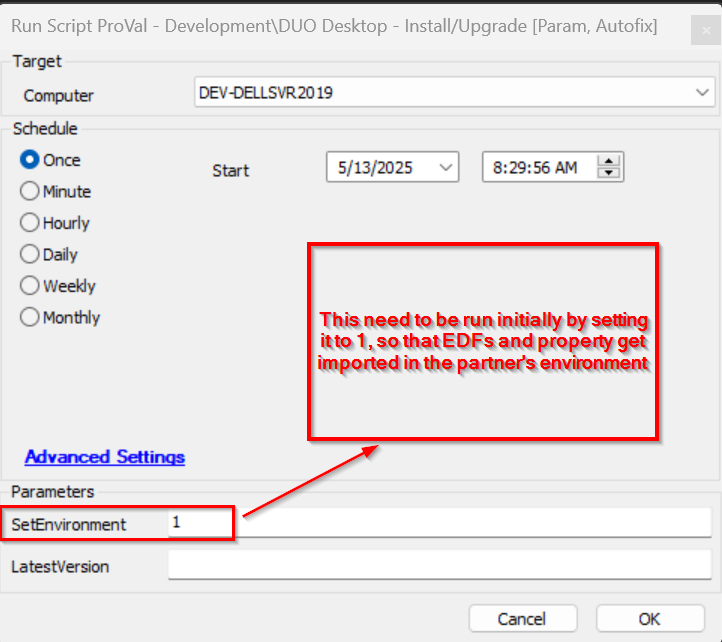
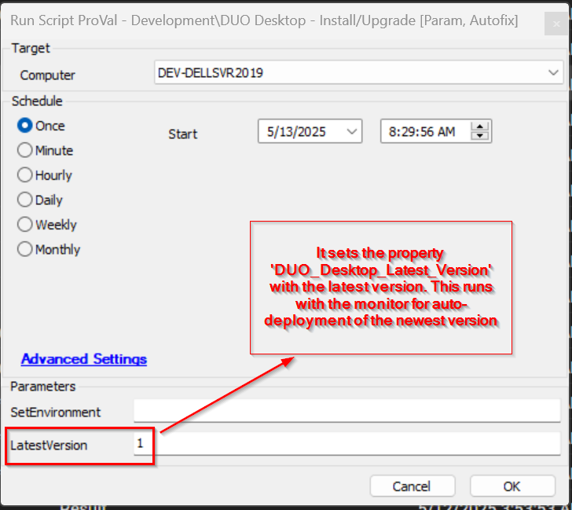
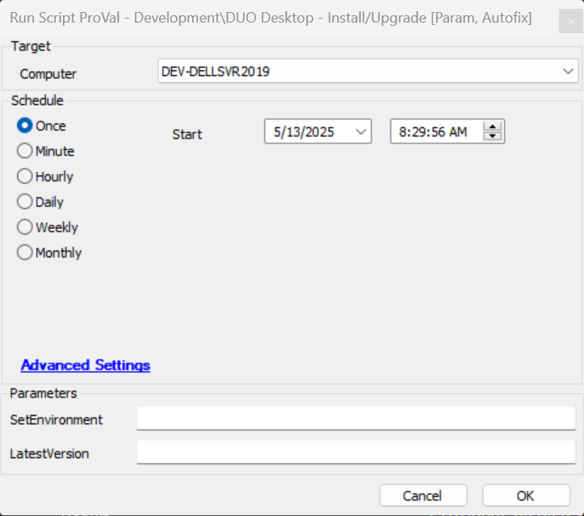
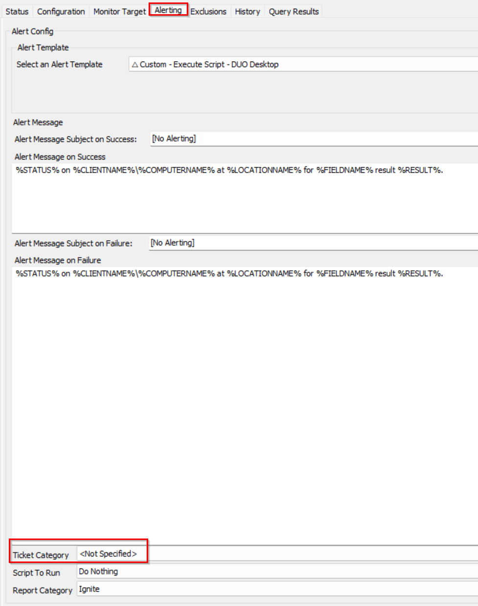

## Summary
This script performs the installation/upgrade of the DUO Desktop to the latest version.

## Sample Run

Run the script after importing once by setting the value of SetEnvironment to 1, so that all the required EDFs and property is imported.

Run the script after importing once by setting the value of LatestVersion to 1, so that the deployment gets started after storing the latest version to the system property 'DUO_Desktop_Latest_Version'.

Normal execution for the DUO Desktop latest installation

## Dependencies

[Monitor - DUO Desktop - Install/Update](/docs/af4b8838-ad2d-4b77-90ce-4447873c4b5c)  
[Monitor - DUO Desktop - Latest Version Detection](/docs/c2082154-028d-40fc-beb4-2e8137d2aa57)  
[Solution - DUO Desktop Deployment Solution](/docs/8adb49f7-d8be-4725-a136-bc59e185743c)

## Variable

| **Name**           | **Description**                                                                 |
|--------------------|---------------------------------------------------------------------------------|
| **Result**         | Fetches the data from the monitor `testvalue` that comes from the autofix alert template. |
| **Status**         | Fetches the data from the monitor status that comes from the autofix alert template.     |
| **TicketCreationCategory**         | It stores the data from the monitor ticket category that comes from the autofix alert template.     |
| **WorkingDirectory** | Directory where the DUO Desktop MSI, logs, and PowerShell scripts (`.ps1`) will be stored. |
| **Tickid**         | Stores the existing ticket ID for the computer to reduce duplicate ticket noise. |
| **shellresult**    | Stores the output of the DUO Desktop deployment.                                 |

## EDF 

| **Name**                        | **Type** | **Level**  | **Example** | **Required** | **Description**                                                                                   |
|---------------------------------|----------|------------|-------------|--------------|---------------------------------------------------------------------------------------------------|
| **Enable Duo Desktop Deployment** | Flag     | Client     | 1 or 0       | True         | The agents will start getting the auto-deployment of the DUO Desktop only if this flag is checked. |
| **Exclude DUO Desktop Deployment** | Flag     | Location   | 1 or 0       | False        | If checked, the agents at that location will be excluded from the DUO Desktop deployment.         |
| **Exclude DUO Desktop Deployment** | Flag     | Computer   | 1 or 0       | False        | If checked, the  computer will be excluded from the DUO Desktop deployment.         |

## System Properties

| **Name**                    | **Value** | **Description**                                                       |
|-----------------------------|-----------|------------------------------------------------------------------------|
| **DUO_Desktop_Latest_Version** | 7.6.0     | Stores the latest version of the DUO Desktop application.              |

## User Parameter

| **Name**         | **Example** | **Required** | **Description**                                                                                      |
|------------------|-------------|--------------|------------------------------------------------------------------------------------------------------|
| **SetEnvironment** | 1 or 0     | False        | If set to 1, it performs the EDF and property import. Running it once before setting the deployment or during the script import is mandatory. |
| **LatestVersion**  | 1 or 0     | False        | If set to 1, it sets the latest version to the property `DUO_Desktop_Latest_Version`. Running it once before setting the deployment or during the script import is mandatory. |

## Process

Import the script and execute it once with both user parameters (SetEnvironment and LatestVersion) values by setting them to 1 separately.
This will set the EDF and property imported, and also enable the deployment based on the latest version.
This script is designed to run on demand, or as an autofix auto-deployment as well.

## Output

- Script log