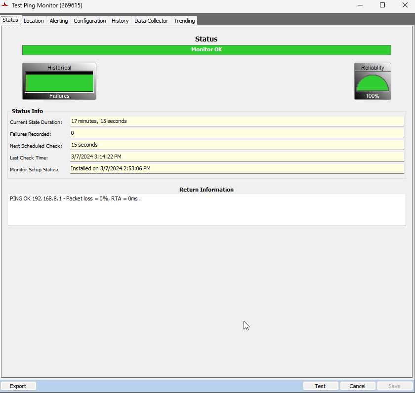
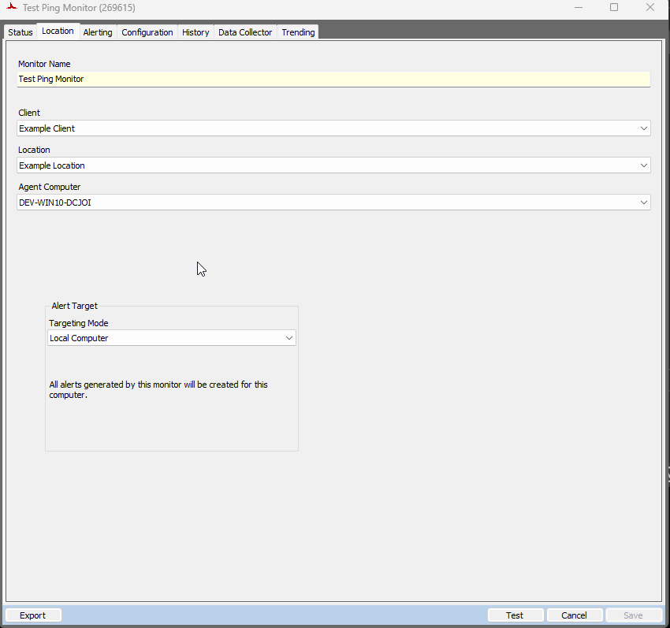
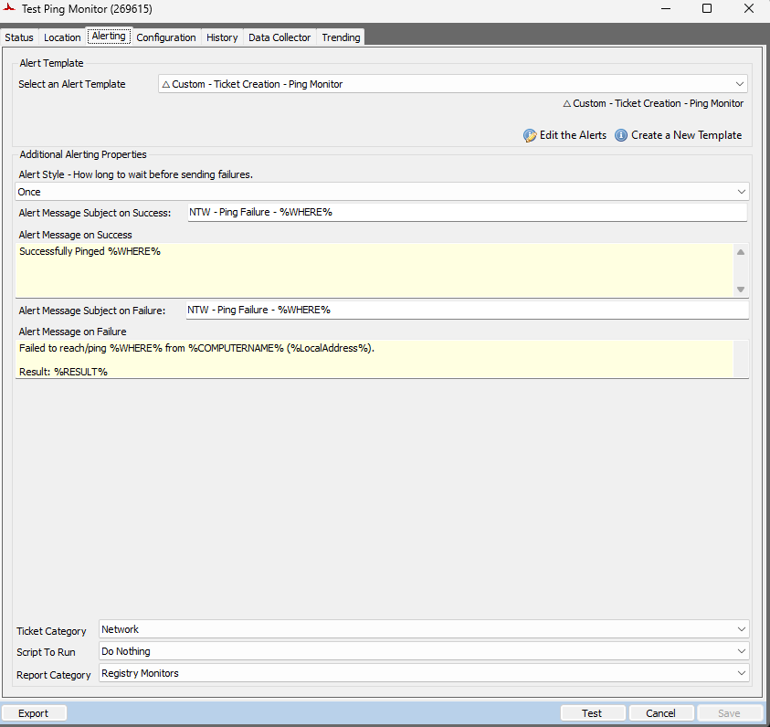
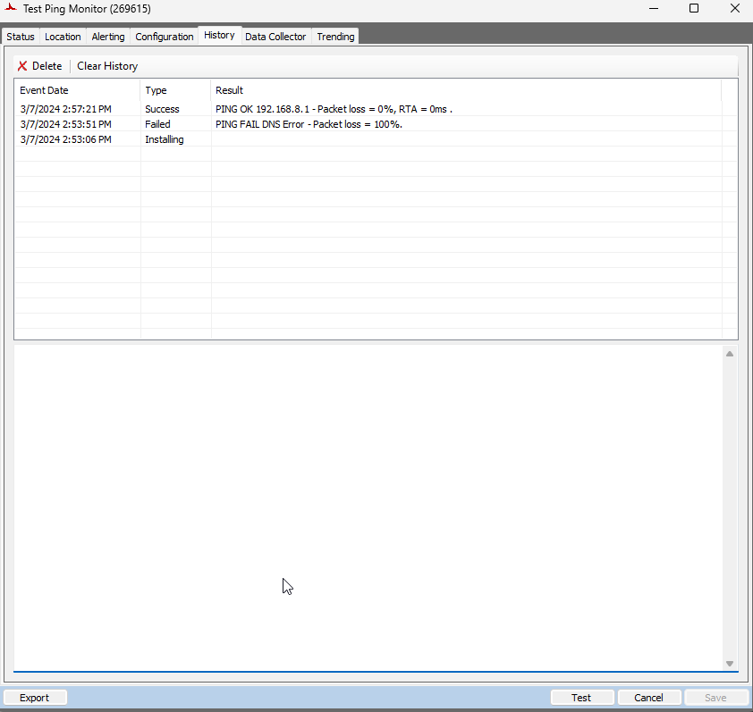

## Summary

This script is an email version of [CWM - Automate - Script - Ticket Creation - Ping Monitor](/docs/7cd1193a-c796-4545-b707-758e1b651c22). It will manage emails related to remote ping monitors.

## Sample Run

The script is not intended for manual execution. It is explicitly configured to be executed exclusively from the `△ Custom - Email Creation - Ping Monitor` alert template.

## Dependencies

Alert Template: `△ Custom - Email Creation - Ping Monitor`

## System Properties

| Name                        | Required | Example                             | Description                                                                                                   |
|-----------------------------|----------|-------------------------------------|---------------------------------------------------------------------------------------------------------------|
| _sysPingMonitorDefaultEmail  | False    | [xyz@something.com](mailto:xyz@something.com) | Add the email address where the partner would like to receive alerts from ping monitors.                     |
| _sysTicketDefaultEmail      | True     | [xyz@something.com](mailto:xyz@something.com) | If nothing is mentioned in the _sysPingMonitorDefaultEmail property, the script will use the default email address from the _sysTicketDefaultEmail property. |

*Note: Create this system property `_sysPingMonitorDefaultEmail` under system → Dashboard → Config → Properties before executing this system anywhere if the client would like to use a specific email address for ping monitors.*

## Global Parameters

| Name              | Required | Example | Description                                                                                                           |
|-------------------|----------|---------|-----------------------------------------------------------------------------------------------------------------------|
| Email_On_Success  | False    | 1       | Set it to 1 to receive success email alerts. Leave it blank or set it to 0 if the partner doesn't want success email alerts. |

## Sample Ping Monitor

**Status Tab:**  

**Location Tab:**  

**Alerting Tab:**  

**Subject:** `NTW - Ping Failure - %WHERE%`

**Failure Message:**  
`Failed to reach/ping %WHERE% from %COMPUTERNAME% (%LocalAddress%).`

`Result: %RESULT%`

**%WHERE%:** `This variable returns the IPv4 Address or Host Name to ping.`  
**%RESULT%:** `This variable returns the result from the monitor set.`  
**%LocalAddress%:** `This variable returns the private address of the local computer where the monitor set is executed.`

**Configuration Tab:**  

**History Tab:**  

## Output

- Email

