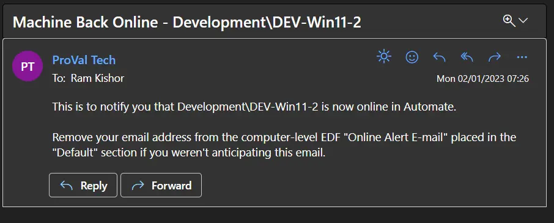

## Summary

This script is intended to be used with the [CWM - Automate - Internal Monitor - ProVal - Development - Agent - E-Mail - Machine Back Online](/docs/82c2d005-f115-4481-8c59-82b22526eafa) monitor. It will send an email to the addresses mentioned in the computer-level EDF "Online Alert E-mail."

## Sample Run

To be executed as an Autofix script only. The `△ Custom - E-Mail - Machine Back Online` alert template calls the script.

## Dependencies

[CWM - Automate - Internal Monitor - ProVal - Development - Agent - E-Mail - Machine Back Online](/docs/82c2d005-f115-4481-8c59-82b22526eafa)

## Variables

| Name    | Description                                         |
|---------|-----------------------------------------------------|
| Status  | Success/Failed status returned by the monitor set.  |
| Email   | Email addresses saved in the `Online Alert E-mail` EDF. |
| Subject | Email Subject.                                     |
| Body    | Email Body                                         |

## Process

- Set the variables
- Send the Email

## Output

- Email  
  Sample Email:  
  