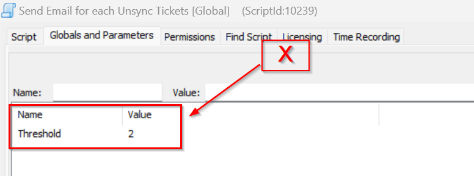
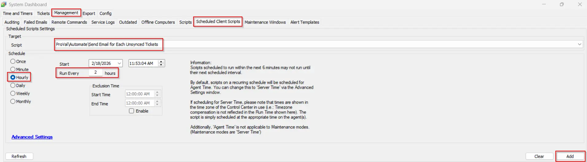
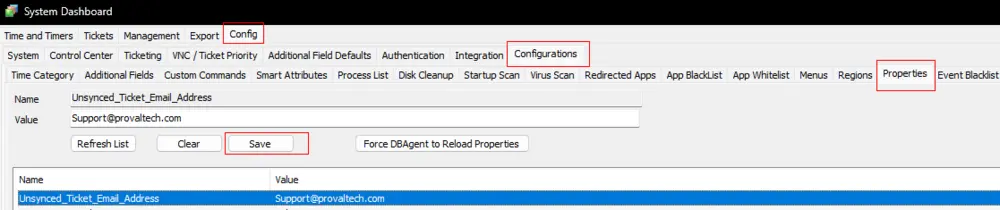
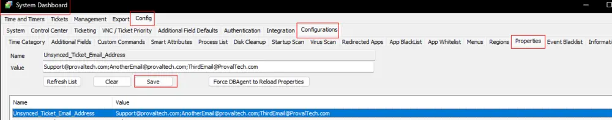
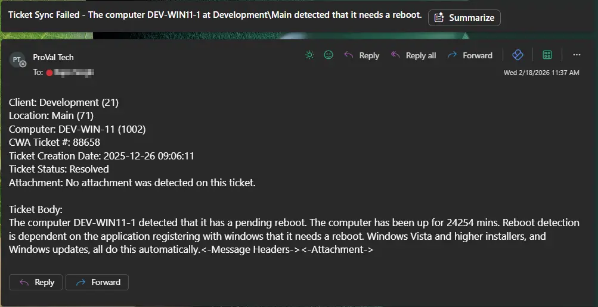

## Summary

The purpose of the script is to send an email notification for each ticket that failed to sync with PSA in the past **X** hours. **X** is the number of hours set for the Global Parameter `Threshold`.

**Requirements:**

1. Ticket Sync should be enabled in the CW Manage Plugin.
2. The System Property 'Unsynced_Ticket_Email_Address' **MUST be manually created**. The script will NOT function without this property.

**Note:**

- All locations and clients that are 'Ignored' within the Manage Plugin will NOT report unsynced tickets for those locations/clients.
- It will detect the tickets that were generated at least 30 minutes ago to avoid false positives.

Remove the internal monitor [**Ticket Sync Unsuccessful**](/docs/1fa27f5d-ca9d-4bff-8776-569a15f772d3) from the partner's environment before implementing this script.

## Sample Run

It is a client script and should be scheduled to run once per **X** hours. **X** is the number of hours set for the script's Global Parameter `Threshold`.



Schedule:


## Variables

| Name   | Description                                |
|--------|--------------------------------------------|
| Email  | Email Address(es) to send the Email       |
| Subject| Email Subject                             |
| Body   | Email Content                             |

### Global Parameters

| Name      | Default | Required | Description                                       |
|-----------|---------|----------|---------------------------------------------------|
| Threshold | 2       | True     | Number of past hours to check the unsynced tickets from. |

### System Properties

| Name                           | Example                          | Required | Description                                                                 |
|--------------------------------|----------------------------------|----------|-----------------------------------------------------------------------------|
| Unsynced_Ticket_Email_Address  | [example@example.com](mailto:example@example.com) | True     | Address(es) to send the email. Multiple addresses should be separated by a semicolon (;). |

**Examples:**

- Single Email Address:  

- Multiple Email Addresses:  


**Note:** The script will not create the system property. Hence, this system property should be created before scheduling/running the script. Otherwise, the script will not work.

## Output

- Email

## Email

**Subject:** 'TSF - %subject%'

**Body:**

```PlainText
%body%

Ticket Sync Failed – Resolution Steps
Automate Ticket (%ticketID%) failed to sync to PSA and may have synced later, potentially creating a duplicate.
Step 1: Assign this ticket to the correct client.
Step 2: Check PSA for the synced version of this ticket.
Step 3: If a duplicate exists, reference the synced ticket and close this one.
Step 4: If no duplicate exists, proceed with this ticket as normal.
```

**Sample Screenshot:**  
