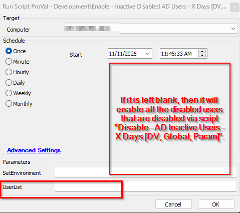
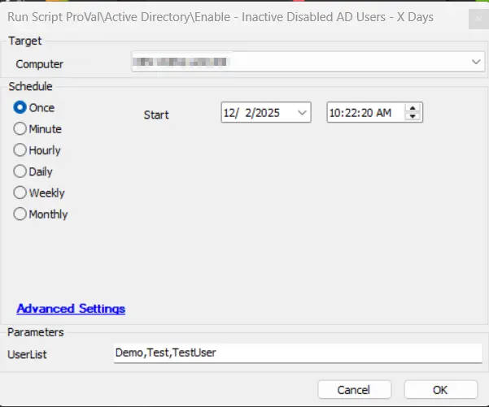
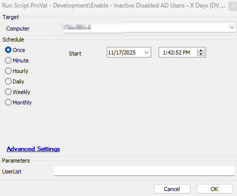
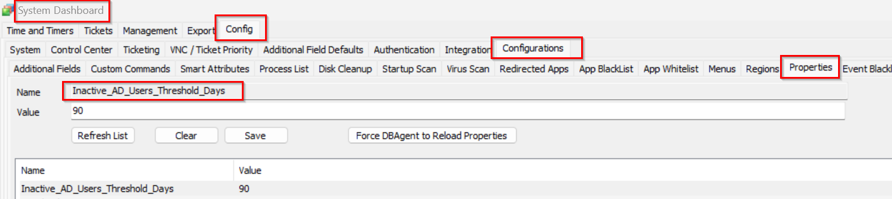
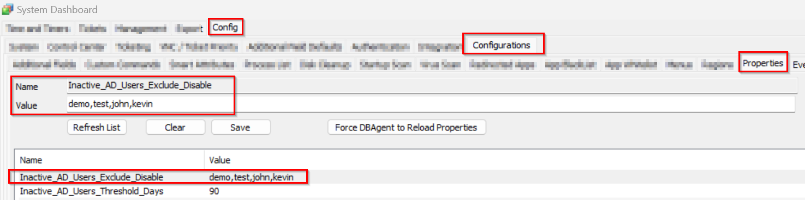

## Summary

This script enables the inactive users that are not logged in for over X days.

## Sample Run

- If set to `All`, all inactive disabled users exceeding the `Threshold_Days` will be enabled

- If it is set to some specific user's name, e.g., `Demo,Test,TestUser`, then it will enable only the provided users.  

- If it is left `blank`, then it will enable all the disabled users that are disabled via [Script - Disable - AD Inactive Users - X Days](/docs/b793791e-2305-4ac5-ace3-b5737368190e)  

## File Hash

| Path | Algorithm | Hash |
| --- | --- | --- |
| `C:\ProgramData\_automation\script\Inactive_ADUsers\Activate_DisabledADUser.ps1` | MD5 | `DA9FF8368ABCFB19E1C2DD2302E689C5` |
| `C:\ProgramData\_automation\script\Inactive_ADUsers\Activate_DisabledADUser.ps1` | SHA256 | `9773431D7F0B51100F51947FDE08302E7B715FDC2603F8C8D7023186FF61BDF4` |

## Dependencies

[Solution- Inactive AD Users Disable/Enable](/docs/d93ff68b-9515-4d4c-bfa4-ff551b3eac37)

### User Parameters

| **Name**    | **Example**                | **Required** | **Description**                                                                                                                                                                                                 |
|-------------|----------------------------|--------------|-----------------------------------------------------------------------------------------------------------------------------------------------------------------------------------------------------------------|
| `UserList`  | `test,demo,testuser`      | False        | To run with autofix using the internal monitor, `UserList` does not need to be set. If the script runs `on demand`, then if:   (i) `UserList` = `All` → Enables all inactive, disabled users exceeding `Threshold_Days`.   (ii) `UserList` = `Demo,Test,TestUser` → Enables only the specified users.   (iii) `UserList` left `blank` → Enables all disabled users that were disabled via [Script - Disable - AD Inactive Users - X Days](/docs/b793791e-2305-4ac5-ace3-b5737368190e) |

## System Property

| Name           | Level                   | Required | Description      |
|---------------------------------|--------| ---------- | ----------------------------------- |
| Inactive_AD_Users_Threshold_Days | 90 | True | This is set to detect the inactive users those are not logged in from the provided days.  |
| Inactive_AD_Users_Exclude_Disable | demo,test,testuser | False | This will exclude the users from being included in the list to get disabled. The user's list should be provided in a comma-separated format. e.g., John,Kevin,demo. | 

## Process

This script enables the inactive users that are not logged in for over X days.

**UserList:** If set to `All`, then all inactive, disabled users exceeding the `Inactive_AD_Users_Threshold_Days` will be enabled.

**NOTE:** To run the script as an autofix with the internal monitor, the `UserList` does not need to be set.

If the script runs on demand, then there are options:

If it is set to some specific user's name, e.g., `Demo,Test,TestUser`, then it will enable only the provided users.

- If it is left `blank`, then it will enable all the disabled users that are disabled via [Script - Disable - AD Inactive Users - X Days](/docs/b793791e-2305-4ac5-ace3-b5737368190e)

    - Here X = `Inactive_AD_Users_Threshold_Days` set in the system property.
This script excludes the default account `Administrator|Guest|krbtgt|DefaultAccount|.*\$`.

        Here, `*\$` meant any user that has $ in its name end.

    For e.g. ``Computername$`` ``UserName$``

It also excludes users that are stored in the `Exclude AD Inactive UserList` EDFs at client level.

It works as follows:

1) If the property `Inactive_AD_Users_Exclude_Disable` is provided and the Client EDF `Exclude AD Inactive UserList` is set with the users, then script will exclude the users list from property `Inactive_AD_Users_Exclude_Disable` `+` `Exclude AD Inactive UserList` Client EDF list.

2) If the property `Inactive_AD_Users_Exclude_Disable` is empty and the Client EDF `Exclude AD Inactive UserList` is set, then the Client EDF `Exclude AD Inactive UserList` list of users will be excluded.

3) If property `Inactive_AD_Users_Exclude_Disable` has user lists and the EDFs at client level `Exclude AD Inactive UserList` is empty, then the script `Inactive_AD_Users_Exclude_Disable` will be accepted for the exclusion.

## Output

- [Table - pvl_ad_inactive_users](/docs/2b118df6-1fef-4530-9303-0bb56c478361)
- [Dataview - AD Inactive Users Audit](/docs/9c9888a7-678a-497f-8f61-11e21e020999)
- Output