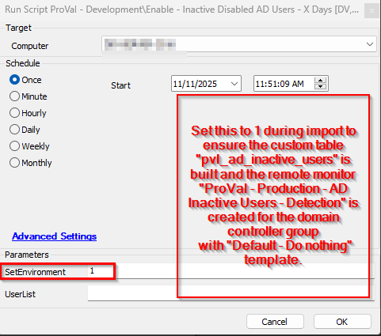

## Summary

This script enables the inactive users that are not logged in for over X days.

## Sample Run

## File Hash

MD5 - `D443303DAD60C3553E456430FB283849`

SHA256 - `E6D3EA2A1320E07F8E0F18F1375CF23320184C996B0E76B1CD899A9E899CA269`

## Dependencies

[Solution- Inactive AD Users Disable/Enable](/docs/d93ff68b-9515-4d4c-bfa4-ff551b3eac37)

### User Parameters

| **Name**    | **Example**                | **Required** | **Description**                                                                                                                                                                                                 |
|-------------|----------------------------|--------------|-----------------------------------------------------------------------------------------------------------------------------------------------------------------------------------------------------------------|
| `SetEnvironment` | 1 | False | Set this to 1 during import to ensure the [Table - pvl_ad_inactive_users](/docs/2b118df6-1fef-4530-9303-0bb56c478361) and [Monitor - AD Inactive Users - Detection](/docs/0e776272-5ec0-4693-962b-38b97cd06cb9) are created for the domain controller group with `Default - Do Nothing` template |
| `UserList`  | `test,demo,testuser`      | False        | To run with autofix using the internal monitor, `UserList` does not need to be set. If the script runs `on demand`, then if (i) `UserList` = `All` → Enables all inactive, disabled users exceeding `Threshold_Days`. (ii) `UserList` = `Demo,Test,TestUser` → Enables only the specified users. `UserList` left `blank` → Enables all disabled users that were disabled via [Script - Disable - AD Inactive Users - X Days](/docs/b793791e-2305-4ac5-ace3-b5737368190e) |

## Global Parameters

| Name          | Example                                                                                   | Required | Description                                                       |
|---------------|-------------------------------------------------------------------------------------------|----------|-------------------------------------------------------------------|
| Threshold_Days     | 90 | True     |  It defines the number of days since the user wasn't logged in to the domain environment.                                             |
| ExcludeList     | demo,test,testuser | False     |  This will exclude the users from being included in the list to get enabled. The user's list should be provided in a comma-separated format. e.g., John,Kevin,demo.                                             |

## Process

This script enables the inactive users that are not logged in for over X days.

The user parameter of the script `UserList` uses:

To run it with the autofix with the internal monitor, the `UserList` does not need to be set.
If the script runs on demand, then there are options:

UserList: If set to `All`, then all inactive, disabled users exceeding the `Threshold_Days` will be enabled.

If it is set to some specific user's name, e.g., `Demo,Test,TestUser`, then it will enable only the provided users.

If it is left `blank`, then it will enable all the disabled users that are disabled via [Script - Disable - AD Inactive Users - X Days](/docs/b793791e-2305-4ac5-ace3-b5737368190e) [Disable - AD Inactive Users - X Days](/docs/b793791e-2305-4ac5-ace3-b5737368190e).
Here X = `Threshold_Days` set in the Global Parameter.
This script excludes the default account `Administrator|Guest|krbtgt|DefaultAccount|.*\$`.

Here, `*\$` meant any user that has $ in its name end.

For e.g. ``Computername$`` ``UserName$``

It also excludes users that are stored in the `Exclude AD Inactive UserList` EDFs at the client/location level.

It works as follows:

1) If the Script `ExcludeList` is provided and the Location EDF `Exclude AD Inactive UserList` is set with the users, then the script will exclude the `Excludelist` `+` `Exclude AD Inactive UserList` Location EDF list.

2) If the Script `ExcludeList` is provided and the Client EDF `Exclude AD Inactive UserList` is set with the users and the location EDF `Exclude AD Inactive UserList` is empty, then the script will exclude the users list of `Excludelist` `+` `Exclude AD Inactive UserList` Client EDF list.

3)  If the Script `ExcludeList` is empty and the location EDF is set, then the Location EDF list will be excluded.

4) If the Script `ExcludeList` is empty and the location EDF `Exclude AD Inactive UserList` is empty too, and only the Client EDF `Exclude AD Inactive UserList` is set, then the Client EDF `Exclude AD Inactive UserList` list of users will be excluded.

5) If Script `ExcludeList` has user lists and the EDFs at the location/client level `Exclude AD Inactive UserList` is empty, then the script `ExcludeList` will be accepted for the exclusion.

## Output

- Custom table
- Dataview
- Output