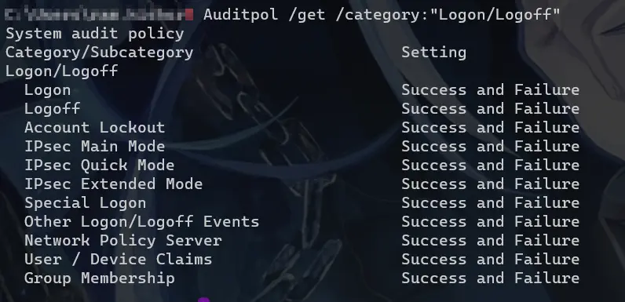
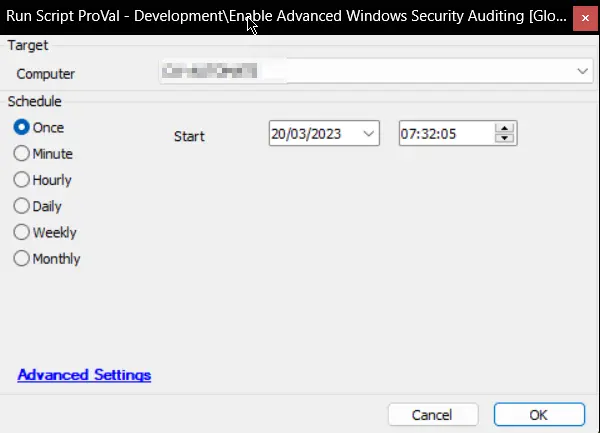
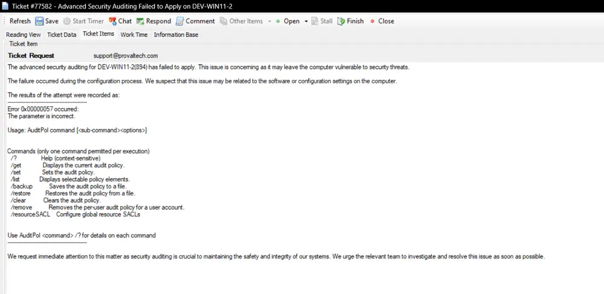

## Summary

The script is designed to fully enable Advanced Windows Security Auditing on a computer system. It attempts to configure the system's security settings to capture all security events, ensuring that the system is better protected against potential security threats.

In addition to enabling Advanced Windows Security Auditing, the script is also capable of creating a ticket for failure if configured in the global variables. This ticket will alert the system administrator of the failure to enable security auditing and prompt them to take corrective action.

## Sample Run

## Dependencies

[CWM - Automate - Remote Monitor - Enable Advanced Windows Security Auditing](/docs/0a012cf5-0ead-442a-bc82-f5c5fe0b13f8)

## Variables

| Name        | Description                                                   |
|-------------|---------------------------------------------------------------|
| STATUS      | Status returned by the monitor set (SUCCESS/FAILED)          |
| shellresult | Output of the command enabling the Advanced Windows Security Auditing |
| tickid      | Ticket ID of the already existing ticket for failure          |

### Global Parameters

| Name                    | Default | Required | Description                                                                                               |
|-------------------------|---------|----------|-----------------------------------------------------------------------------------------------------------|
| ticketcreationcategory   | 0       | False    | Set the ticket category ID to create a ticket. Leaving it as 0 will not allow the script to create a ticket on failure |

## Output

- Script Log
- Ticket

## Sample Ticket

