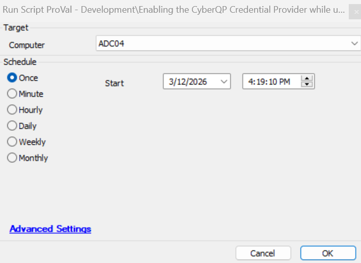

## Summary

When you install Duo, other logon credential providers are disabled and hidden (your end-users can refer to this as the "logon tiles" on their Windows sign-in screen). 
This hiding feature also hides the `Technician Sign-In` tile used for our Passwordless MFA for technicians solution. This script will go in-depth with instructions to bring back the `Technician Sign-In` tile so that you may use the Passwordless MFA for technicians solution while Duo is still running on the same machine.
Note: This script will only perform the whitelist if the `QuickpassServerAgent` service is running and `Duo Authentication for Windows Logon x64` is installed.

## Sample Run

## Dependencies

## Output

- Script Logs

## Changelog

### 2026-03-12

- Added this new script to enable the CyberQP Credential Provider while using Duo as per the article referenced below:
  https://support.getquickpass.com/hc/en-us/articles/22720858271895-Enabling-the-CyberQP-Credential-Provider-while-using-Duo#h_01HWB3Q6E45JJC9SYE5RG996XT

