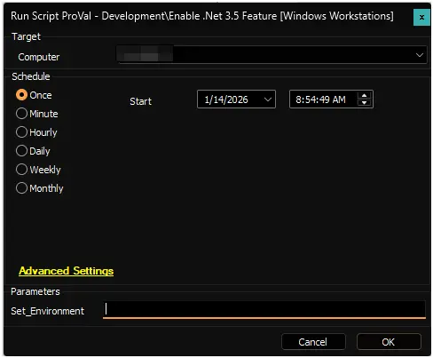

## Summary

This script installs the .NET Framework 3.5 feature. It pre-configures the 'RepairContentServerSource' registry policy to bypass local WSUS and download source files directly from Windows Update, preventing common installation errors (0x800f081f).

## Sample Run

**First Run:** Run the script with the `Set_Environment` parameter set to `1` for the first run to create the EDFs used by the solution.

**Regular Execution:**  

## Dependencies

- [Solution: Enable .Net 3.5](/docs/5d596cd8-3e9d-4a03-a610-ec85f8a9fb19)

## User Parameters

| Name                | Example | Required                        | Description |
| ------------------- | ------- | ------------------------------- | ----------- |
| Set_Environment     | 1       | True (for first execution)      | Run the script with the `Set_Environment` parameter set to `1` for the first run to create the EDFs used by the solution. |

## EDFs

| Name | Type | Scope | Section | Required | Description |
| ---- | ---- | ----- | ------- | -------- | ----------- |
| Enable .Net 3.5 Feature | Checkbox | Client | Automation | False | Set to enable automated installation of the .NET 3.5 feature for a client. |
| .Net 3.5 Feature - Exclusion | Checkbox | Location | Exclusions | False | Set to exclude an entire location from automated installation. |
| .Net 3.5 Feature - Exclusion | Checkbox | Computer | Exclusions | False | Set to exclude an individual computer from automated installation. |

## Output

- Script Logs
