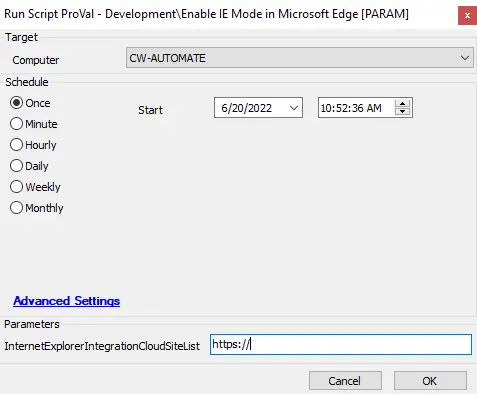

## Summary

This script enables IE mode for a particular site.  
Please provide the variable `InternetExplorerIntegrationCloudSiteList` in PowerShell to allow other sites to open in IE mode within Edge.

## Sample Run

## Variables

| Name                          | Description                                               |
|-------------------------------|-----------------------------------------------------------|
| Enabled IE Mode in Edge      | Computer EDF - Checked when IE Mode is set in Edge       |

#### User Parameters

| Name                          | Example    | Required | Description                                           |
|-------------------------------|------------|----------|-------------------------------------------------------|
| InternetExplorerIntegrationCloudSiteList | https://   | True     | The site link that needs to open in Edge in IE Mode   |

## Process

This script enables IE mode for a particular site.  
Please provide the variable `InternetExplorerIntegrationCloudSiteList` in PowerShell to allow other sites to open in IE mode within Edge.  
Once the setting is done, it checks the computer EDFs for logging in the database.

## Output

- Script log

