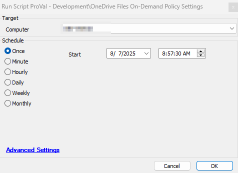

## Summary

This script sets the OneDrive Files On-Demand Policy settings at the system and user level.

## File Hash

**File Path:** `C:\ProgramData\_Automation\Script\OneDrive-OnDemandSettings\OneDrive-OnDemandSettings.ps1`  
**File Hash (Sha256):** `59FC02D3967387BE216D32FA6D45CC85B3ECC311BBC3C021C51412356488EA4F`  
**File Hash (MD5):** `4258BC7673023F53B76389AC5F04B2AB`  

## Sample Run

## Output

- Script log
- Local file:  `C:\ProgramData\_Automation\Script\OneDrive-OnDemandSettings\OneDrive-OnDemandSettings-log.txt`
