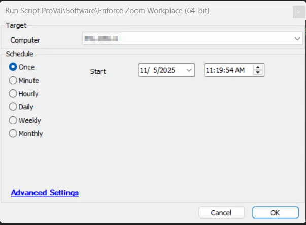

## Summary

This script performs a comprehensive replacement of any existing Zoom installations (32-bit or 64-bit) with `Zoom Workplace (64-bit)`. It handles both system-level and user-level installations, ensuring a clean uninstallation before installing the new version.

## Sample Run

## Files Hash

- **File Path:** `C:\ProgramData\_automation\Script\Enforce-ZoomWorkPlace64Bit\Enforce-ZoomWorkPlace64Bit.ps1`  
- **File Hash (Sha256):** `F87DCB921BF9CBE69497B3363DB96F1291B1B87EA0B834FAC028E3720424709B`  
- **File Hash (MD5):** `54E5F040FB6844CE21FE449DE9823987`

## Variables

| Name | Value |
| ---- | ----- |
| ProjectName | Enforce-ZoomWorkPlace64Bit |
| WorkingDirectory | C:\ProgramData\_Automation\Script\Enforce-ZoomWorkPlace64Bit |
| PS1Path | C:\ProgramData\_Automation\Script\Enforce-ZoomWorkPlace64Bit\Enforce-ZoomWorkPlace64Bit.ps1 |
| AppDirectory | C:\ProgramData\_Automation\App\ZoomWorkPlace |
| InstallerPath | C:\ProgramData\_Automation\App\ZoomWorkPlace\ZoomWorkPlace.msi |
| UninstallerZipPath | C:\ProgramData\_Automation\App\ZoomWorkPlace\CleanZoom.zip |
| UninstallerPath | C:\ProgramData\_Automation\App\ZoomWorkPlace\CleanZoom.exe |
| InstallerLogPath | C:\ProgramData\_Automation\App\ZoomWorkPlace\ZoomWorkPlace.log |
| UninstallerLogPath | C:\ProgramData\_Automation\App\ZoomWorkPlace\CleanZoom.log |
| InstallerDownloadUrl | https://www.zoom.us/client/latest/ZoomInstallerFull.msi?archType=x64 |
| UninstallerDownloadUrl | https://assets.zoom.us/docs/msi-templates/CleanZoom.zip |

## Output

- Script logs
