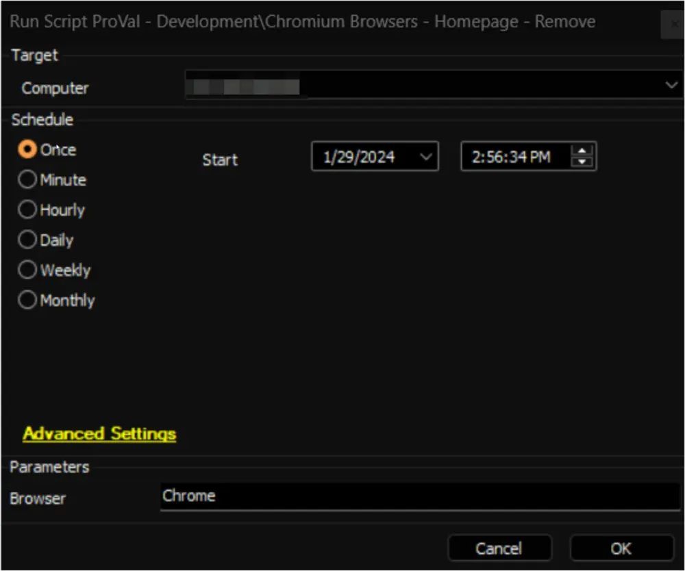
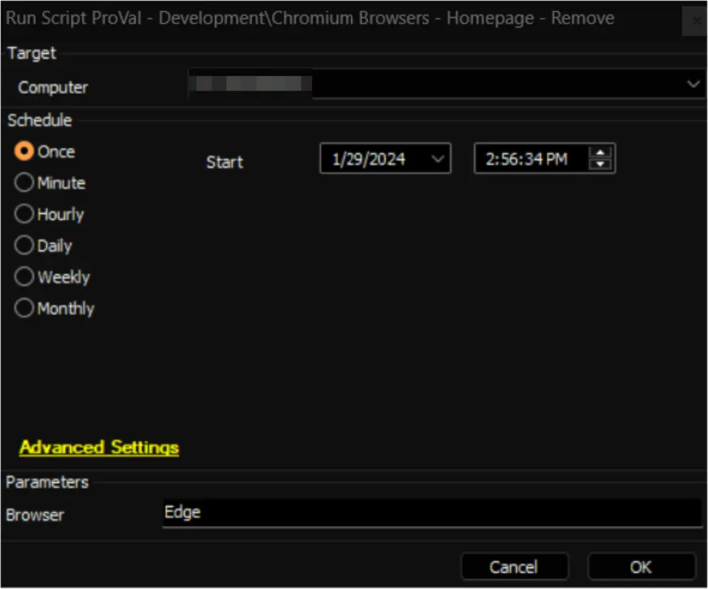
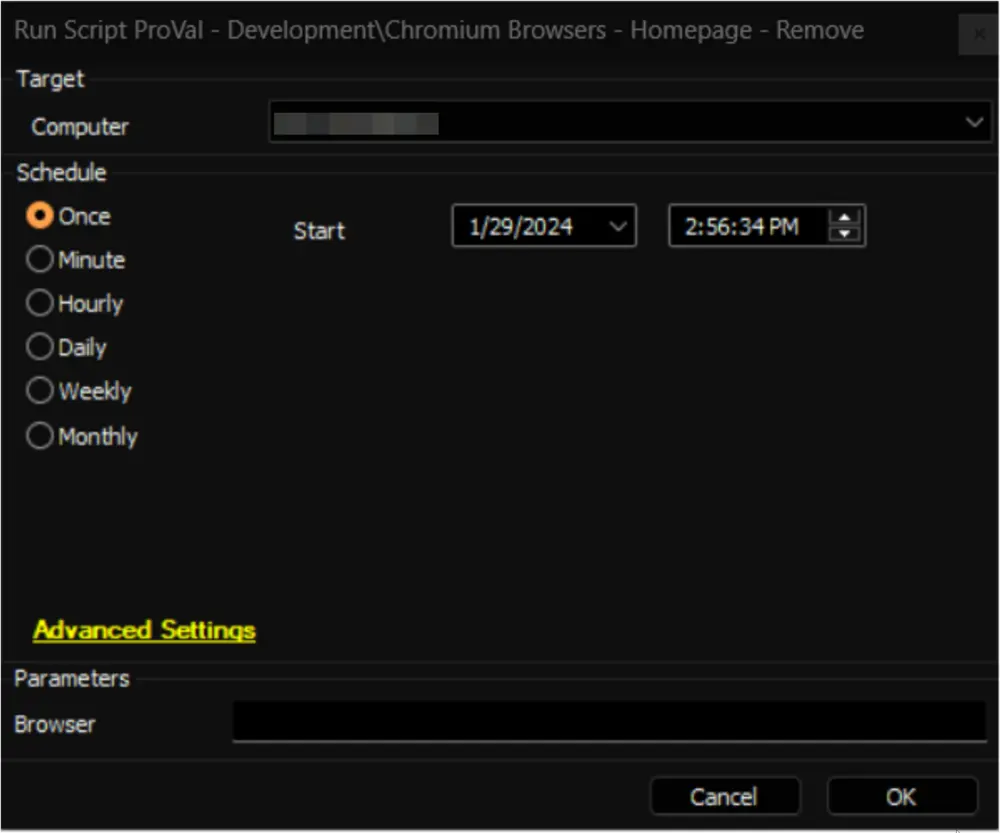

## Summary

This document presents an Automate implementation of the [Remove-ChromiumHomepage](/docs/38674bcd-8b19-4072-a58f-314efad2e856  ) agnostic script to remove the registry policy for an enforced homepage in Chromium browsers. The supported browsers are `Google Chrome` and `Microsoft Edge`.

The `Browser` parameter can be used to specify the browser's name.

## Sample Run

- Removing the homepage from Google Chrome:  
  
  
- Removing the homepage from Microsoft Edge:  
  
  
- Removing the homepage from both Google Chrome and Microsoft Edge:  
  

## Dependencies

[Remove-ChromiumHomepage](/docs/38674bcd-8b19-4072-a58f-314efad2e856  )

## User Parameters

| Name    | Example | Required | Description                                                                                                                                                                                                                       |
|---------|---------|----------|-----------------------------------------------------------------------------------------------------------------------------------------------------------------------------------------------------------------------------------|
| Browser | Chrome  | False    | The 'Browser' parameter designates the browser for removing the homepage. Acceptable values are 'Chrome' and 'Edge'. If this parameter is left blank, the script will attempt to remove the homepage for both Chrome and Edge browsers. |

## Output

- Script Logs