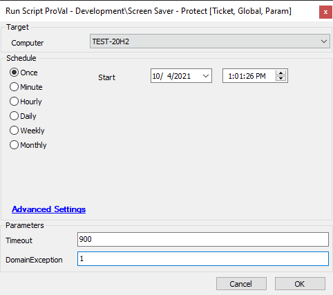

## Summary

This document ensures that the screen saver settings are enabled and set to the specified timeout.

## Sample Run



## Dependencies

[Protect-ScreenLock](/docs/9c89e293-7f28-4e7c-936f-e285b04e8df0)

## Variables

`@FileAttachUser@` - Dynamic UserID for attaching files to a ticket.

### Global Parameters

| Name             | Example | Required | Description                                                                                              |
|------------------|---------|----------|----------------------------------------------------------------------------------------------------------|
| EnableTicketing  | 1       | True     | Set to 1 to enable ticketing when a domain exception is in place and the settings are not set properly. |

### User Parameters

| Name             | Example | Required | Description                                                                                              |
|------------------|---------|----------|----------------------------------------------------------------------------------------------------------|
| Timeout          | 900     | True     | The timeout in seconds to set for the screen saver.                                                     |
| DomainException   | 1       | False    | Set to 1 to run a GPRESULT instead of making configuration changes when a machine is part of a domain. |

## Process

See [Protect-ScreenLock](/docs/9c89e293-7f28-4e7c-936f-e285b04e8df0)

## Output

```
./Protect-ScreenLock-log.txt
./Protect-ScreenLock-data.txt
./Protect-ScreenLock-error.txt
./gpresult_computer.html
./gpresult_user.html
```


