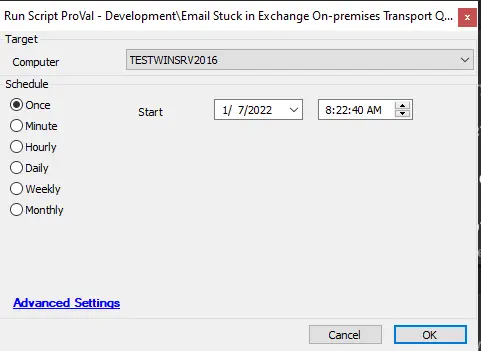

## Summary

This document resolves the stuck email issue in Microsoft Exchange based on the following article: [Email Stuck in Exchange On-Premises Transport Queues](https://techcommunity.microsoft.com/t5/exchange-team-blog/email-stuck-in-exchange-on-premises-transport-queues/ba-p/3049447).

## Sample Run

## Dependencies

- [Email Stuck in Exchange On-Premises Transport Queues](https://techcommunity.microsoft.com/t5/exchange-team-blog/email-stuck-in-exchange-on-premises-transport-queues/ba-p/3049447)

## Variables

| Name                   | Description                                                                                     |
|------------------------|-------------------------------------------------------------------------------------------------|
| ExchangeEmailCheck     | This contains data of the scan engine version and installs the latest safest version to avoid the vulnerability. |

### Script States

| Name                     | Example               | Description                                                        |
|--------------------------|-----------------------|--------------------------------------------------------------------|
| ExchangeEmailCheck_OnPrem| The server impacted    | This informs whether a vulnerability was found and if it has been fixed. |

## Process

This script will run PowerShell to perform the following steps:

**Verify the impacted version is installed**  
Run `Get-EngineUpdateInformation` and check the `UpdateVersion` information. If it starts with "22...", then proceed. If the installed version starts with "21...", you do not need to take action.

**Remove existing engine and metadata**  
1. Stop the Microsoft Filtering Management service. When prompted to also stop the Microsoft Exchange Transport service, click Yes.  
2. Use Task Manager to ensure that `updateservice.exe` is not running.  
3. Delete the following folder: `%ProgramFiles%/Microsoft/Exchange Server/V15/FIP-FS/Data/Engines/amd64/Microsoft.`  
4. Remove all files from the following folder: `%ProgramFiles%/Microsoft/Exchange Server/V15/FIP-FS/Data/Engines/metadata.`

**Update to latest engine**  
1. Start the Microsoft Filtering Management service and the Microsoft Exchange Transport service.  
2. Open the Exchange Management Shell, navigate to the Scripts folder (`%ProgramFiles%/Microsoft/Exchange Server/V15/Scripts`), and run *Update-MalwareFilteringServer.ps1 \<server FQDN>.

**Verify engine update info**  
1. In the Exchange Management Shell, run *Add-PSSnapin [Microsoft.Forefront.Filtering.Management](http://microsoft.Forefront.Filtering.Management).Powershell*.  
2. Run *Get-EngineUpdateInformation* and verify the `UpdateVersion` information is 2112330001 (or higher).

## Output

- Script log
- Dataview