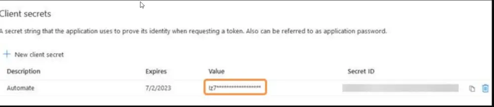

## Summary

This script is designed to automatically generate and distribute a report on the Multi-Factor Authentication (MFA) status of Office 365 users for a specified ClientID. The report is sent via email to the individual executing the script, provided that an email address has not been pre-set in the user parameter `EmailAddress`.

The script employs the [Microsoft.Graph](https://github.com/microsoftgraph/msgraph-sdk-powershell) PowerShell module to establish a connection with the Office 365 portal and generate the report. As there is no provision for a silent or remote connection to the Office 365 portal using Office 365 credentials, the script utilizes the [Using PSCredential object](https://github.com/microsoftgraph/msgraph-sdk-powershell/blob/dev/docs/authentication.md#client-credential-via-client-secret) method for this purpose.

To effectively use this script, it is imperative to have the Office 365 ClientID, TenantID, and Client Secret. This information can either be supplied as user parameters when running the script or stored in the client-level EDFs as detailed in the article below.

Please note that this script is designed for professional use and requires a certain level of technical expertise for successful execution. It is recommended to thoroughly understand the script and its requirements before running it.

**Note of Caution**: Its functionality is not guaranteed on any computer running a version of PowerShell older than 5. Please ensure your systems are updated to at least PowerShell version 5 for optimal performance.

## How to Create Office 365 ClientID, TenantID, and Client Secret?

### Register Office 365 Application

To register an application:

1. Go to [https://www.portal.azure.com](https://www.portal.azure.com) and log in with your Azure admin credentials. If you do not have an account, create one at this time.
2. On the homepage under Azure services, click **App Registrations**.  
   
3. Click **New Registration**.  
   
4. Enter a name for the registration.  
   
5. Under **Supported account types**, select **Accounts in this organizational directory only (Single tenant)**.  
   
6. Click **Register**. Your application is created, and you are redirected to your application page to generate a client secret for this application.
7. Click **Certificates & secrets**.  
   
8. Click **New client secret**.
9. Enter a **Description**.
10. Select the longest possible duration (currently two years) under **Expires**.
11. Click **Add**. Your client secret is generated. Copy and save the **Value** (not the Secret ID). You need this code to configure Automate patch installs. The client secret Value is never displayed again after you leave this page. Next, add permissions to your application.  
    **Warning**: Copy and save the Value (not the Secret ID) before proceeding; the Value is never displayed again after you navigate away from this screen.  
    
12. Click **API permissions**.  
    
13. Click **Add a permission**.  
    
14. Select **Microsoft Graph**.  
    
15. Click **Application permissions**.
16. In the search bar, enter **User**.
17. For **User permissions**, select the application permissions `User.Read.All` and `User.Export.All`.
18. In the search bar, enter **AuthenticationMethod**.
19. For **User authentication method permissions**, select the application permission `UserAuthenticationMethod.Read.All`.
20. Remove the default permission `User.Read` (Delegated type), which is not needed.
21. Click **Add permissions**. A **Preparing content** button displays. Proceed when the button is no longer disabled.
22. Click **Grant admin consent**. A confirmation window displays.  
    
23. Click **Accept**. Each permission is granted.  
    
24. Click **Overview** to view your **Application (client) ID** and **Directory (tenant) ID**. Keep this page open as you need to enter this ID to configure the required EDFs in Automate.  
    

## Sample Run

- The script will generate a report for the ClientID `24`. This report will then be dispatched via email to the addresses specified in the user parameter `EmailAddress`. The script will utilize the information provided in these parameters to establish a connection with the Office 365 portal.  
  
- The script will generate a report for the client associated with the computer on which the script is executed. This report will subsequently be emailed to the user who initiated the script. The script will leverage the information stored in the client-level EDFs to establish a connection with the Office 365 portal.  
  

## Global Variables

| Name              | Default | Required | Description                                                       |
|-------------------|---------|----------|-------------------------------------------------------------------|
| Failure_Tickets    | 1       | True     | 0 or 1 to disable or enable the ticket creation function of the script. |

## User Parameters

| Name                      | Example                                    | Required | Description                                                                                                                                                                                                                                                                                                                                                           |
|---------------------------|--------------------------------------------|----------|-----------------------------------------------------------------------------------------------------------------------------------------------------------------------------------------------------------------------------------------------------------------------------------------------------------------------------------------------------------------------|
| EmailAddress              | [support@provaltech.com](mailto:support@provaltech.com); [Alerts@provaltech.com](mailto:Alerts@provaltech.com) | False    | The email address or addresses that will receive the generated report. If this parameter is left blank, the script will default to sending the report to the email address of the user executing the script. In the case of multiple email addresses, each address should be separated by a semicolon.                                                                 |
| Automate_ClientID         | 21                                         | False    | This parameter specifies the Automate Client for which the report will be generated. If this parameter is left blank, the script will default to generating a report for the client associated with the computer on which the script is executed. This parameter offers flexibility, allowing the script to be run on a centralized computer (for example, an Automate server) and generate reports for all clients. |
| Office365_Client_ID       | 4e9b6c4a-8e38-46a1-9f7c-4f9a1fc3d7f5    | True (if the Client-Level EDF `M365 Client ID` is not set) | Office 365 Client ID. If this parameter is left blank, the script will default to using the value stored in the client-level EDF `M365 Client ID.`                                                                                                                                                                                                                   |
| Office365_Tenant_ID       | 78d61825-d966-4a3d-a3a8-5408e8acc66c      | True (if the Client-Level EDF `M365 Tenant ID` is not set) | Office 365 Tenant ID. If this parameter is left blank, the script will default to using the value stored in the client-level EDF `M365 Tenant ID.`                                                                                                                                                                                                                   |
| Office365_Client_Secret    | W/c9zFv622GjDgY+ZaPPFJiO3Z6GpD4R/9a+CT4yGA= | True (if the Client-Level EDF `M365 Client Secret` is not set) | Office 365 Client Secret. If this parameter is left blank, the script will default to using the value stored in the client-level EDF `M365 Client Secret.`                                                                                                                                                                                                          |

## Client-Level Extra Data Fields

| Name              | Example                                    | Required | Description                                                                                                      |
|-------------------|--------------------------------------------|----------|------------------------------------------------------------------------------------------------------------------|
| M365 Client ID     | 4e9b6c4a-8e38-46a1-9f7c-4f9a1fc3d7f5    | True (Otherwise set the value in the user parameter `Office365_Client_ID` while running the script.) | Office 365 Client ID                                                                                              |
| M365 Tenant ID     | 78d61825-d966-4a3d-a3a8-5408e8acc66c      | True (Otherwise set the value in the user parameter `Office365_Tenant_ID` while running the script.) | Office 365 Tenant ID                                                                                              |
| M365 Client Secret  | W/c9zFv622GjDgY+ZaPPFJiO3Z6GpD4R/9a+CT4yGA= | True (Otherwise set the value in the user parameter `Office365_Client_Secret` while running the script.) | Office 365 Client Secret                                                                                          |

These EDFs are in the Client-Level EDF section `Office 365 - MFA Status Report`.  

## Output

- Script Log
- Email
- Ticket

## Email

**Subject:** `\<ClientName> - Office 365 Users MFA Stats Report - \<TimeStamp>`

**Body:** `Attached CSV file is the Office 365 Users MFA Stats Report for the client \<ClientName>.`

**File Name Example:** `MfaStatusReport_2023-Sep-23-Sat 01-51 PM.csv`

## Ticketing

The script can create a ticket for failures. The ticketing feature can be toggled by the script's global parameter `Failure_Tickets`.

**Ticket Subject:** `Failed to Gather Office 365 Users MFA Report for \<Client Name>`

**Ticket Body for configuration error:** `The script was unable to initiate the PowerShell script due to the absence of the necessary key configurations. Set the Office365 ClientID, TenantID, and Client Secret in the Client level EDFs 'Office 365 - ClientID', 'Office 365 - TenantID', and 'Office 365 - Client Secret' respectively for \<Client Name>. The EDFs are present in the Client level EDF section 'Office 365 - MFA Status Report'. Alternatively, you can pass the required values in the script's user parameters 'Office365_Client_ID', 'Office365_Tenant_ID', and 'Office365_Client_Secret' respectively while initiating the script.`

**Ticket Body for the script failure:** `The script was unable to initiate the PowerShell script due to the absence of the necessary key configurations. <Error returned by the PowerShell script>`
