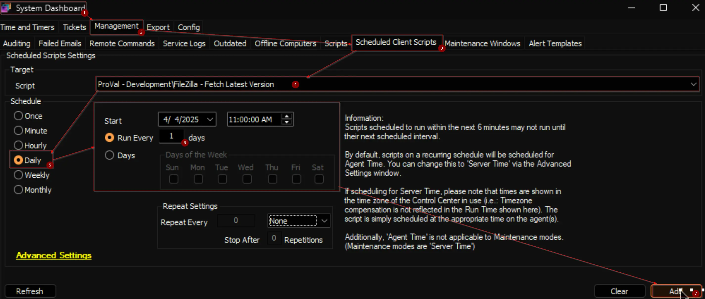

## Summary

The script fetches the latest version of FileZilla from its official website and saves it to the system property `Filezilla_Latest_Version`. *It requires at least one Windows 10/11 computer with FileZilla installed in the environment to function.*

## Update Notice: 2025-08-21

Updated the logic to fetch latest available version of Filezilla.

## Sample Run

This is a client script and is recommended to be scheduled to run daily during working hours.  

## Properties

| Name | Example | Required | Description |
| ---- | ------- | -------- | ----------- |
| Filezilla_Latest_Version | 3.68.1 | True | Stores the latest available version of FileZilla, which is utilized by the [Update FileZilla](/docs/ea7ef637-8620-499a-a982-a805a11e14c7). *Modifying it is not recommended.* |

## Output

- Property