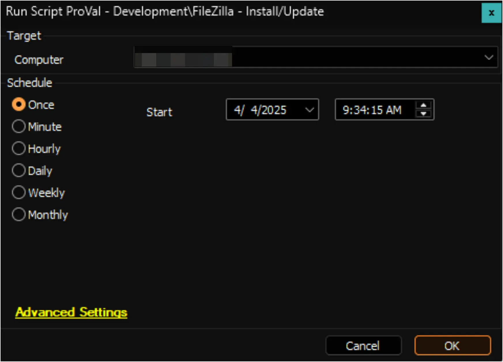

## Summary

The script installs the latest version of FileZilla on a Windows computer. If the application is missing, it will install it, and if outdated, it will update it to the latest version. When executed as an Autofix from an internal monitor with a configured ticket category, the script can generate a ticket in case of failure.

## Update Notice: 2025-08-21

Updated the logic to fetch latest available version and download url of Filezilla.

## File Hash

**File Path:** `C:\ProgramData\_automation\Script\Update-FileZilla\Update-FileZilla.ps1`  
**File Hash (Sha256):** `91C9358560F2DE0F85C41190B30755E621C5EF9293FA0857BD9183F11BDCCAED`  
**File Hash (MD5):** `F9DF96EF5B0C372AC10E7FD293F3E2BE` 

## Sample Run



## Output

- Script logs
- Ticket (if enabled)

## Ticketing

**Subject:** `FileZilla Latest Version Installation Failed`

**Ticket Body:**

```plaintext
The script encounter an error when running the process. 

Output: 
<Output of the PowerShell script>
```

**Note:** The script does not create tickets by default. Tickets are generated only when the script is executed as an Autofix from an internal monitor with a configured ticket category. It is used as an Autofix for the [Update FileZilla](/docs/ea7ef637-8620-499a-a982-a805a11e14c7) monitor set. To enable ticketing, assign a ticket category to this monitor set.  

