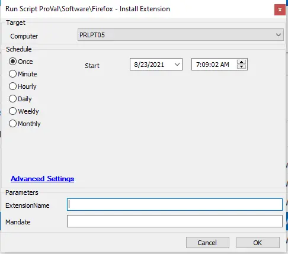

## Summary

This script can be used to install and optionally enforce an extension in Mozilla Firefox.

**Time Saved by Automation:** 5 Minutes

## Sample Run

## Dependencies

- PowerShell v5
- Mozilla Firefox
- [Agnostic - Register-FirefoxExtension](/docs/db0512b5-70cd-4145-aa69-de84f9b1846d)

## Variables
| Variable Name      | Description                                                                                     |
|--------------------|-------------------------------------------------------------------------------------------------|
| @PS1DataLog@ |Helps to verify if the script actually succeeded. |
| @PS1ErrorLog@ | Helps to track the failure of the script. |

#### User Parameters

| Name              | Example   | Required | Description                                                |
|-------------------|-----------|----------|------------------------------------------------------------|
| ExtensionName    | Grammarly | True     | The name of the extension from the URL to install into Firefox. |
| Mandate          | 1         | False    | Use this switch to prevent the removal of the target add-on in Firefox. |

## Output

- Script log
- Local file on the computer