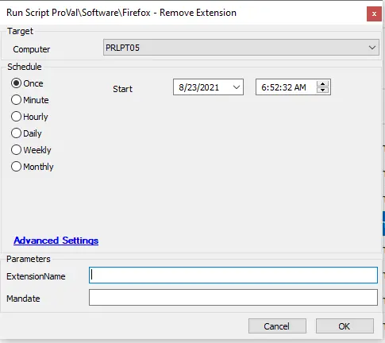

## Summary

This script can be used to remove and optionally block an extension in Mozilla Firefox.

**Time Saved by Automation:** 5 Minutes

## Sample Run

## Dependencies

- PowerShell v5
- Mozilla Firefox
- [Agnostic - Unregister-FirefoxExtension](/docs/e9295813-fbf2-43fe-b6a0-20da0ae7b21d)

## Variables

| Variable Name      | Description                                                                                     |
|--------------------|-------------------------------------------------------------------------------------------------|
| @PS1DataLog@ |Helps to verify if the script actually succeeded. |
| @PS1ErrorLog@ | Helps to track the failure of the script. |

### User Parameters

| Name               | Example   | Required | Description                                                                 |
|--------------------|-----------|----------|-----------------------------------------------------------------------------|
| ExtensionName     | Grammarly | True     | The name of the extension from the URL to remove from Firefox.             |
| Mandate           | 1         | False    | Use this switch to prevent future installation of the target addon in Firefox.|

## Output

- Script log
- Local file on computer