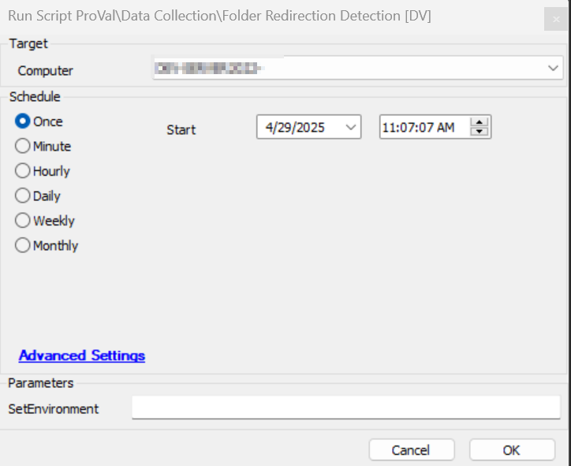
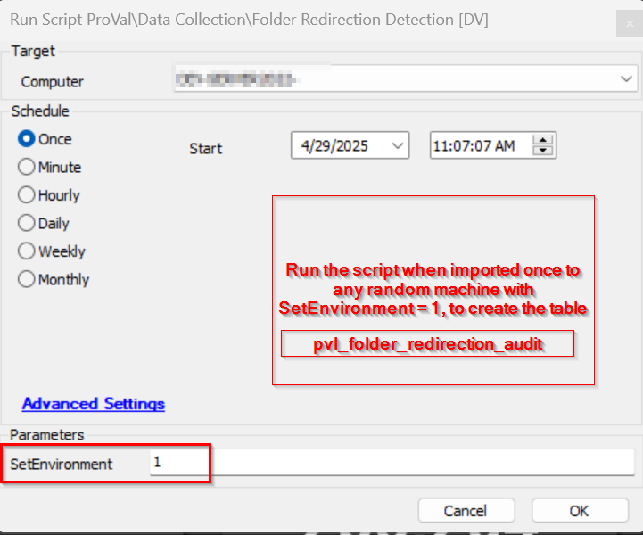

## Summary
This script performs the folder redirection audit for the redirected folders of all users of the Windows machines. The folders which are used for audit are (Desktop, Document, Download, My Picture, My Video,  My Pictures,  Local AppData,  History,  Cookies,  Cache,  AppData,  Favorites,  Fonts,  CD Burning,  Administrative Tools,  NetHood,  Personal,  PrintHood,  Programs,  Recent,  SentTo,  Start Menu,  StartUp,  Templates)

## Sample Run

## Dependencies

[DataView - Folder Redirection Audit [Script]](/docs/e7d25f05-6d80-4baa-94b8-517f81abc4a5)  
[Table - pvl_folder_redirection_audit](/docs/1c5bd6c3-ed3e-49df-884c-b3cd6c90f629)  
[Solution - Folder Redirection Audit](/docs/37f95f1c-ee3e-43d5-a530-ab5023fec2c5) 

#### Global Parameters

| Name                     | Example | Required | Description                                                                                     |
|--------------------------|---------|----------|-------------------------------------------------------------------------------------------------|
| TableName | pvl_folder_redirection_audit       | True    | Setting this variable will create the table with that name. It is not recommended to change it as the DV is aligned to the provided tablename as set in the example.          |

#### User Parameters

| Name        | Example                       | Required | Description                                                                                                                                                   |
|-------------|-------------------------------|----------|---------------------------------------------------------------------------------------------------------------------------------------------------------------|
| SetEnvironment        | 1                   | False     | If set to 1, then the script will create the table with the table name set in the Global parameter only.                                               |

## Process 

This script downloads the strapper module and executes the Strapper command "Get-UserRegistryKeyProperty" to gather the folder redirection of all active users on the computer for the folders (Desktop, Document, Download, My Picture, My Video,  My Pictures,  Local AppData,  History,  Cookies,  Cache,  AppData,  Favorites,  Fonts,  CD Burning,  Administrative Tools,  NetHood,  Personal,  PrintHood,  Programs,  Recent,  SentTo,  Start Menu,  StartUp,  Templates)

## Output

- Script Log
- Dataview
- Table pvl_folder_redirection_audit