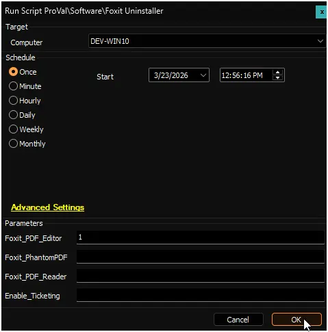
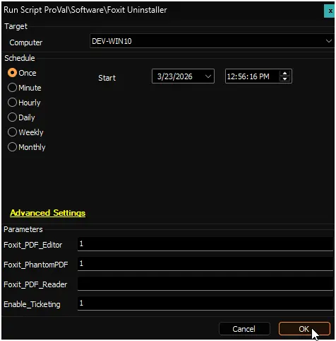
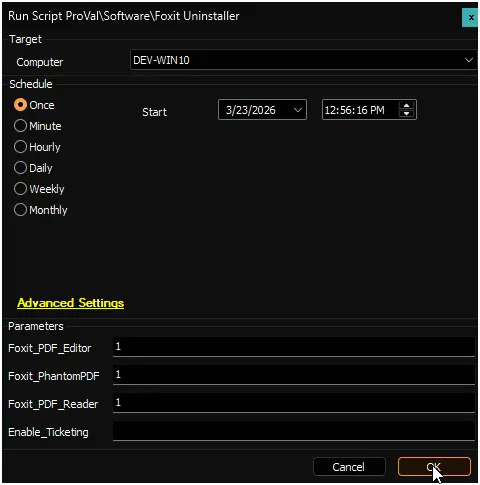
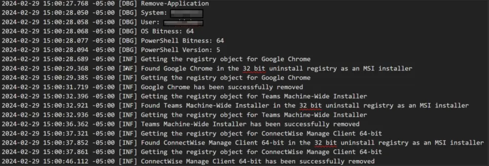

## Summary

This script removes specified Foxit applications using the [Remove Application](/docs/494f7109-e4b2-4ffa-93f8-e33089b09b4e) framework. Select which products to uninstall via user parameters:

- Foxit PDF Editor
- Foxit PhantomPDF
- Foxit PDF Reader

## Sample Run

***Uninstall Foxit PDF Editor***

***Uninstall Foxit PDF Editor, Foxit PhantomPDF and create ticket on failure***

***Uninstall Foxit PDF Editor, Foxit PhantomPDF, and Foxit PDF Reader***

## Dependencies

[Remove-Application](/docs/8230693f-cf73-479d-8279-d2ff54c4296e)

## User Parameters

| Name               | Example                                                         | Mandatory | Description                                                                                                                                                                                                                   |
|--------------------|-----------------------------------------------------------------|-----------|-------------------------------------------------------------------------------------------------------------------------------------------------------------------------------------------------------------------------------|
| Foxit_PDF_Editor               | 1 | Partially | Set to `1` to uninstall `Foxit PDF Editor` |
| Foxit_PhantomPDF               | 1 | Partially | Set to `1` to uninstall `Foxit PhantomPDF` |
| Foxit_PDF_Reader               | 1 | Partially | Set to `1` to uninstall `Foxit PDF Reader` |
| Enable_Ticketing               | 1 | False     | Set to `1` to create a ticket if the uninstallation fails. |

## Output

- Script Logs
- Log file on the end machine
- Ticket (if enabled)

## Ticketing

**Subject:** `Application Removal - Failed - %COMPUTERNAME%`

**Summary:**  
`The script attempted to remove the provided list of application(s) from the computer, but it failed. Initially, the following application(s) were identified as installed out of the provided list:`

- `<Comma Separated Name(s) of the application(s) from the provided list installed initially on the computer>`

`However, the removal process failed for the following application(s):`

- `<Comma Separated list of the application(s) from the provided list that Automate failed to remove from the computer>`

`In addition to the primary removal script (Remove-Application.ps1), alternative uninstallation methods utilizing uninstall strings stored in Automate were also employed. Despite this, the script failed to remove all specified application(s).`

`Please refer to the attached log contents for further investigation. A manual review is required to identify the cause of the failure.`

**Comment:**  
`<Contents of the log file generated by the PowerShell Script>`

**Example:**  

## Changelog

## 2026-03-23

- Initial version of the document
