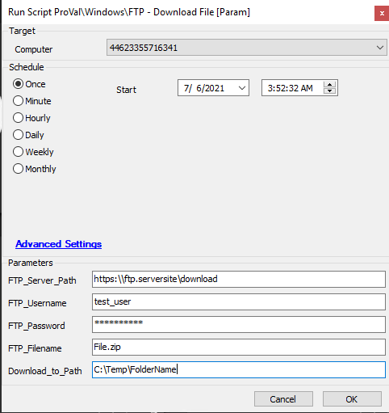

## Summary

This script will download a file from the target FTP server.

**Time Saved by Automation:** 10-20 Minutes

## Sample Run

## Variables

| Variable      | Description                                                                                       |
|---------------|---------------------------------------------------------------------------------------------------|
| PS_Results    | This stores the PowerShell script output, indicating whether the file was successfully downloaded from the provided FTP server or not. |

### User Parameters

| Name               | Example                                 | Required | Description                                                  |
|--------------------|-----------------------------------------|----------|--------------------------------------------------------------|
| FTP_Server_Path    | [https://ftp.server/download](https://ftp.server/download) | True     | The FTP server path where the file is stored.               |
| FTP_Username       | test_user                               | True     | The FTP username to access the FTP site.                    |
| FTP_Password       | testing@123                             | True     | The FTP password to access the FTP site.                    |
| FTP_Filename       | Filename.zip                            | True     | The filename with extension to download from the FTP site.  |
| Download_to_Path   | C:/Windows/Temp/Folder                  | True     | The local destination path on the agent.                     |

## Process

- This script will attempt to download the file from the FTP site.
- It will first check whether all user parameters are provided; if not, the script will exit. If all parameters are provided, it will attempt to download the file from the FTP site as per the provided details.
- It will log the output in the script indicating whether the download was successful or not.

## Output

- Script log

