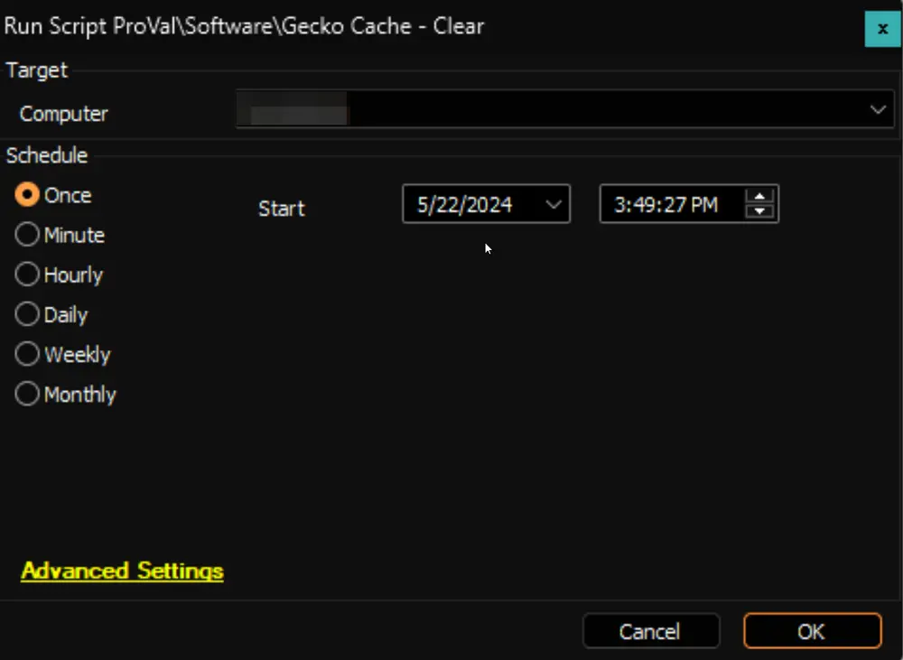

## Summary

This is the Automate implementation of the agnostic script [SWM - Software Configuration - Script - Clear Gecko Cache](/docs/4a400b6b-d468-417f-914b-8094e645fdb4).

## Sample Run

## Output

- Script log

