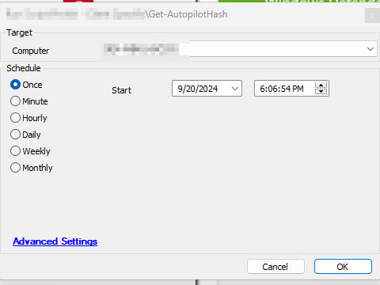

## Summary

This script retrieves the Hardware Hash for Autopilot device registration. It collects the Hardware Hash and stores it in the Computer EDF labeled "Autopilot Hash".

## Sample Run

It is intended to run as an autofix script with [CWA - Internal Monitor - ProVal - Production - Get - Autopilot Hash](/docs/3add591b-445e-440d-a7b3-cc85b2ea0674), but it can also be run independently.

## EDFs

| Name          | Level   | Type  | Description                                                |
|---------------|---------|-------|------------------------------------------------------------|
| Autopilot Hash| Computer| Text  | Script stores the Hardware Hash of a device under this EDF |

## User Parameters

| Name             | Example | Required                                               | Description                                                                                             |
|------------------|---------|------------------------------------------------------|---------------------------------------------------------------------------------------------------------|
| Set_Environment   | 1       | Must be set to 1 for first-time implementation       | Running the script with the user parameter `Set_Environment` as `1` will import the EDFs needed for the script. |

## Output

- Script Logs

