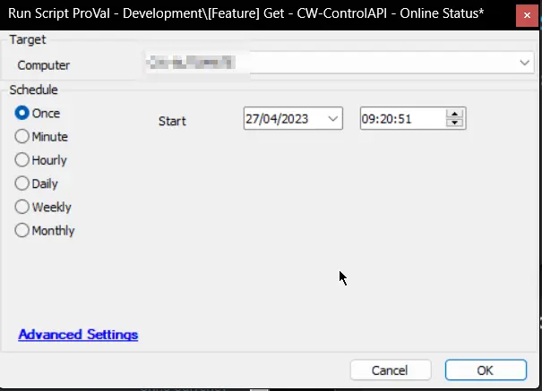

## Summary

The EPM - Data Collection - Script - Get - CW-ControlAPI - Online Status script is a ConnectWise Automate script designed to fetch the online status of all machines in the ConnectWise Control application. To achieve this, the script utilizes the ProVal Tech agnostic script Get-CWControlAgentSession.ps1, which is intended to run only in Automate environments. The script queries the Control session using the Control Plugin in Automate as its jump point.

The purpose of the EPM - Data Collection - Script - Get - CW-ControlAPI - Online Status script is to return the online status of all machines in Control and insert those states into a custom table named `plugin_proval_control_session_status`. The information that the script collects is stored in the Automate database and is used by other scripts and monitors to determine the state of the machines in the ConnectWise environment.

## File Hash

**File Path:** `C:\ProgramData\_automation\Script\Get-CWControlAgentSession\Get-CWControlAgentSession-AI.ps1`  
**File Hash (Sha256):** `95CEEF57C9C2D2B24ED0C620328EDC506DBEEE0518DAE0742A313EAE3BBFDE69`  
**File Hash (MD5):** `AC13C1EB0C924D865DE95A4142AE1DAC`  
**File Path:** `C:\ProgramData\_automation\Script\Get-CWControlAgentSession\Get-CWControlAgentSession.ps1`  
**File Hash (Sha256):** `CA23BBB99EE98806C16FD28A24022B912249536466CB078A0EC37023A1789358`  
**File Hash (MD5):** `6EC5B4A08FB14A5DF47DD5482F578859`  
**File Path:** `C:\ProgramData\_automation\Script\Get-CWControlAgentSession\Manage-OverFlowedVariable.ps1`  
**File Hash (Sha256):** `79B76E6780B61ED657C7FC07C5C0D9A0662165066D5BAD95D9D672513BADD674`  
**File Hash (MD5):** `12B41CDBC04010E638D3FFB8A4BDB1D6`  

## Dependencies

- [Get-CWControlAgentSession](/docs/d0a99efa-a256-47ca-b916-6c18581ba434)
- [OverFlowedVariable - SQL Insert - Execute](/docs/34cee8fe-1b6b-4558-a890-2face427ceb8/)

## Requirements

1. ConnectWise Control must have the Automate extension installed and configured properly.
2. ConnectWise Automate must have the ConnectWise Control plugin installed and configured properly.

## Sample Run

**Intended Target:** Any Windows machine. It is suggested to schedule the script to run twice per day against the Automate server if possible; otherwise, it can be scheduled against any Windows machine.

## Variables

Document the various variables in the script. Delete any section that is not relevant to your script.

| Name            | Description                                                                  |
|-----------------|------------------------------------------------------------------------------|
| TableName       | The name of the new table that will be created if it does not exist.       |
| Server          | The queried server from the ConnectWise Control plugins configuration table.|
| Token           | The queried API key from the ConnectWise Control plugins configuration table.|
| IncludeProperty  | The additional included item from the API call query set to Name.          |

## Output

- Script log
- Custom Table
