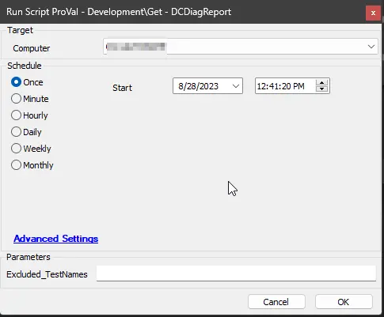
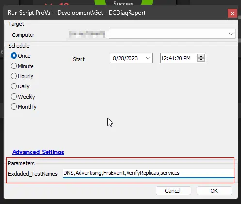
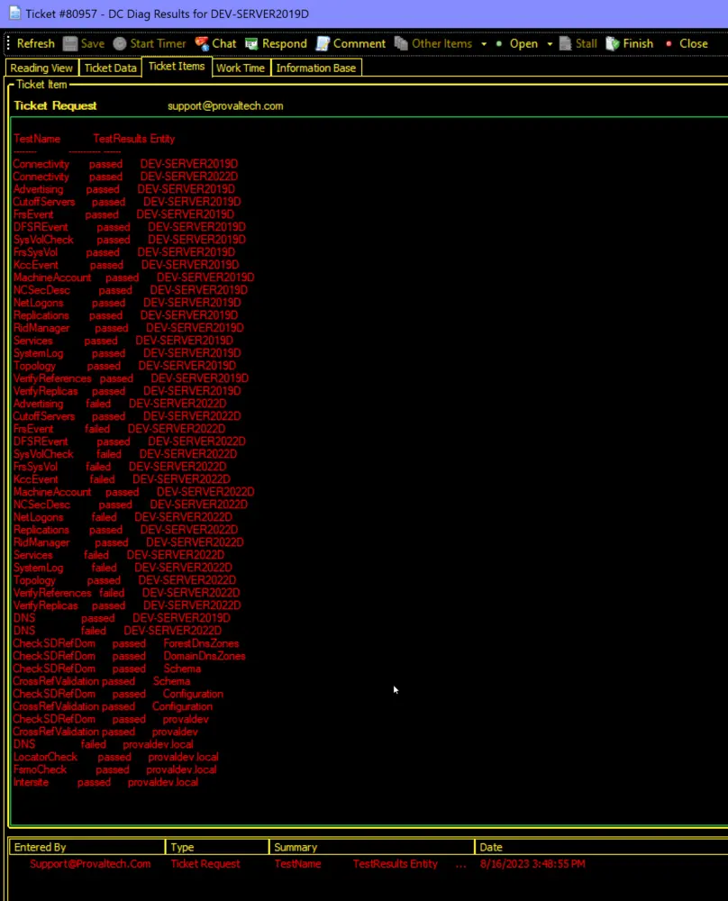

## Summary

This is an automated wrapper for the agnostic Get-DCDiagReport.ps1. The script will create a ticket if the PowerShell script fails on the computer for any reason or if the diagnostic report returns any failure.

## Sample Run

Run the script without setting the `Excluded_TestNames` parameter to perform all available tests during the diagnostic.  

A set of specific test names can be passed to the `Excluded_TestNames` parameter to exclude from the diagnostic.  

## Dependencies

- [EPM - Data Collection - Agnostic - Get-DCDiagReport.ps1](/docs/3c0d8537-9331-4623-90a0-8d2f724d19af)

## Variables

Document the various variables in the script. Delete any section that is not relevant to your script.

| Name                  | Description                                               |
|-----------------------|-----------------------------------------------------------|
| PsExecuteCommand      | The command to send to PowerShell to execute the agnostic script. |
| PowerShellResult      | The result of the DCDiag report.                          |
| TicketFinishBody      | The body of a finished ticket.                            |
| TicketBody            | The body of a created ticket or comment.                 |
| TickID                | The ID of any currently open ticket for this issue.      |

#### Global Parameters

| Name                     | Example                           | Required | Description                                           |
|--------------------------|-----------------------------------|----------|-------------------------------------------------------|
| ProjectName              | Get-DCDiagReport                 | True     | The name of the agnostic solution                     |
| ExpectedSuccessReturn     | TestName                         | True     | Validates the results of the PowerShell execution.    |
| TicketCreateSubject      | DC Diag Results for %ComputerName%| True     | The subject of any ticket created from this script.   |
| TicketCreationCategory    | 1                                 | False    | The ticket creation category for any created ticket from this script. |
| DoNotCommentOpenTicket   | 0                                 | False    | Toggles commenting on open tickets for subsequent runs. |

#### User Parameters

| Name                  | Example                                         | Required | Description                                               |
|-----------------------|-------------------------------------------------|----------|-----------------------------------------------------------|
| Excluded_TestNames    | DNS,Advertising,FrsEvent,VerifyReplicas,Services| False    | Names of the tests to exclude from the diagnostic. Names should be separated by a comma (do not use spaces). Allowed test names are as follows: 'Advertising', 'CutoffServers', 'FrsEvent', 'DFSREvent', 'SysVolCheck', 'FrsSysVol', 'KccEvent', 'MachineAccount', 'NCSecDesc', 'NetLogons', 'ObjectsReplicated', 'Replications', 'RidManager', 'Services', 'SystemLog', 'Topology', 'VerifyReferences', 'VerifyReplicas', 'DNS', 'CheckSDRefDom', 'CrossRefValidation', 'LocatorCheck', 'FsmoCheck', 'Intersite'. |

## Output

- Script log
- Ticket

## Ticketing

  
**The script will not close or finish any ticket.**
