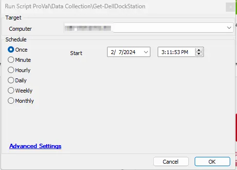

## Summary

This script detects Dell Dockstations on Dell Workstations. Since `Dell Command | Monitor` is required to be installed to detect the dockstations, the script will install it if it's not already present and will proceed to run the commands to detect Dockstations.

The script validates the prerequisites before attempting to install the application. It can create a ticket if the prerequisite validation fails. Additionally, it will attempt to install the `Microsoft Visual C++ 2015-2022 Redistributable` if the required version is not installed.

Computer-level EDF `Unsupported Dell BIOS` will be marked for computers that do not have a supported BIOS.

**Prerequisites:**  
[Prerequisites for Systems Running on Windows](https://www.dell.com/support/manuals/en-us/command-monitor/dellcommandmonitor_rn/prerequisites-for-systems-running-on-windows?guid=guid-aa49b007-8eb3-496b-851b-d2131a8c74b6&lang=en-us)

## Dependencies

[CWM - Automate - Script - OverFlowedVariable - SQL Insert - Execute](/docs/34cee8fe-1b6b-4558-a890-2face427ceb8)  

Note: Since [this installer](https://dl.dell.com/FOLDER11078318M/1/Dell-Command-Monitor_KF06N_WIN_10.10.1.13_A00.EXE) works only with a browser, it can be used in the script to download the installer on the machine. Download the installer on the Client Ltshare and share its path in the script at Line 42.

## Target

Windows 10, Windows 11 Workstations

## Sample Run

This script is designed to be run as an autofix with the [Internal Monitor - Execute Script - Get-DellDockStation](/docs/131057f0-24aa-418c-90f7-b0f316a5b9a8).  

It can also be run manually:  

## Output

- Script Logs
- Tickets

## Ticketing

Set the `Ticket Category` in the [Execute Script - Get-DellDockStation](/docs/131057f0-24aa-418c-90f7-b0f316a5b9a8) monitor to enable ticketing for `Dell Command | Monitor` installation failures.  

**Subject:** Dell Command | Monitor Installation Failed  
