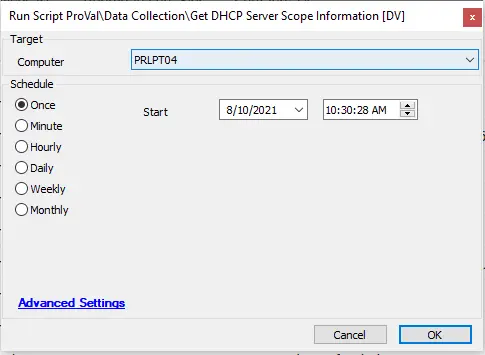

## Summary

This script gathers DHCP information from a target server and saves it to the database for use in a data view or report.

**Time Saved by Automation:** 5 Minutes

## Sample Run

## Process

- Runs a PowerShell command to gather DHCP information from a target server.
- Creates the [plugin_proval_dhcp_statistics](/docs/489fe175-9ac6-420c-be2e-e5faceb956fd) table if it does not exist.

## Output

- Table: `plugin_proval_dhcp_statistics`