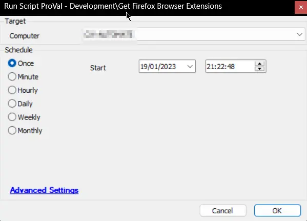

## Summary

An Automate implementation of the agnostic script [Get-FirefoxExtensions](/docs/e45f0be5-66b2-417a-b900-0a6b3b9994f1).

## Sample Run

## Dependencies

- [Get Installed Browsers Extensions [DV]](/docs/f0a2db8c-92b6-4584-a70c-209263d46511)
- [OverFlowedVariable - SQL Insert - Execute](/docs/34cee8fe-1b6b-4558-a890-2face427ceb8)

## Process

- Creates the [Plugin_ProVal_Browsers_Extensions](/docs/0a6370b4-7944-4483-86d5-ecbfd58f5376) script if it does not exist.
- Defines the necessary variables.
- Executes the agnostic script [Get-FirefoxExtensions](/docs/e45f0be5-66b2-417a-b900-0a6b3b9994f1) and stores the data into a JSON file.
- Clears the stale data.
- Executes the [OverFlowedVariable - SQL Insert - Execute](/docs/34cee8fe-1b6b-4558-a890-2face427ceb8) script to parse through the JSON file and insert the data into the [Plugin_ProVal_Browsers_Extensions](/docs/0a6370b4-7944-4483-86d5-ecbfd58f5376) table.
- Logs the successes and failures.

## Output

- Script logs
- Custom Table
- Dataview