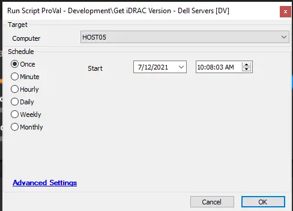

## Summary

The script will fetch the version of iDRAC from Dell servers. The script output will be stored in a script state, which is used by the dataview [iDRAC Version - Dell Servers](/docs/d2168fe5-e9f2-4265-ad4d-ce98ee14cf26).

**Time Saved by Automation:** 5 Minutes

## Sample Run

## Variables

`@iDRAC@`: Stores the formatted iDRAC Version from `%shellresult%` and is further used to store the value in the script state "iDRAC_Version".

### Script States

| Name          | Example       | Description                                         |
|---------------|---------------|-----------------------------------------------------|
| iDRAC_Version | 2.61.60.60    | Version of iDRAC of the concerned Dell Server.     |

## Process

- Works for Dell Servers only.
- Checks if the computer is a Dell Server.
- Runs the `racadm getversion -f idrac` command to fetch the iDRAC Version.
- Sets a variable `@iDRAC@` using the SQL Query `SELECT TRIM(SUBSTRING_INDEX('%shellresult%','=',-1)) AS iDRAC Version` to extract the numerical value from the shell result.
- Assigns that value to the script state `iDRAC_Version`.
- The output of the script can be checked from the "iDRAC Version - Dell Servers" Dataview.

## Output

- Script log
- Script state
- Dataview
