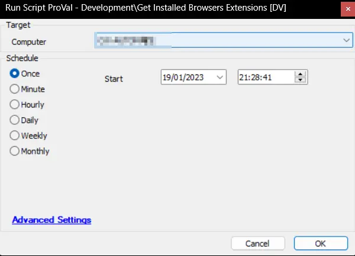

## Summary

This script gathers all the extensions installed on the Google Chrome, Microsoft Edge, Brave, and Mozilla Firefox browsers. It's a wrapper script that executes the [Get Chromium Browsers Extensions](/docs/ff2827dd-bd64-4437-8783-4b576e6cfb81) and [Get Firefox Browser Extensions](/docs/472a8d13-fd00-4a97-90dd-833a171eac40) scripts.

## Sample Run

## Dependencies

- [Get Chromium Browsers Extensions](/docs/ff2827dd-bd64-4437-8783-4b576e6cfb81)
- [Get Firefox Browser Extensions](/docs/472a8d13-fd00-4a97-90dd-833a171eac40)
- [Installed Browsers Extensions [Script]](/docs/9c095cab-514b-479d-a302-bdb596caefe5)

## Global Variables

| Name | Value | Accepted Values | Description |
| ---- | ----- | --------------- | ----------- |
| Debug | `False` | `False`, `True` | When `True`, enables informational logging; when `False` (default), informational logs are suppressed to avoid adding entries to the `h_scripts` table. Set to `True` to assist with troubleshooting. |
| ScriptEngineEnableLogger | `False` | `False`, `True` | When `True`, enables final (success/failure) logging; when `False` (default), these logs are suppressed to avoid adding entries to the `h_scripts` table. Set to `True` to assist with troubleshooting. |

## Variables

| Name    | Description                                        |
|---------|----------------------------------------------------|
| Browser | Used to check the name of the installed browser.   |

## Process

- Refresh software inventory.
- Look for the installed browsers.
- Execute the [Get Chromium Browsers Extensions](/docs/ff2827dd-bd64-4437-8783-4b576e6cfb81) script if any of the `Google Chrome`, `Brave`, or `Microsoft Edge` browsers are installed.
- Execute the [Get Firefox Browser Extensions](/docs/472a8d13-fd00-4a97-90dd-833a171eac40) script if the `Mozilla Firefox` browser is installed.

## Output

- Dataview
