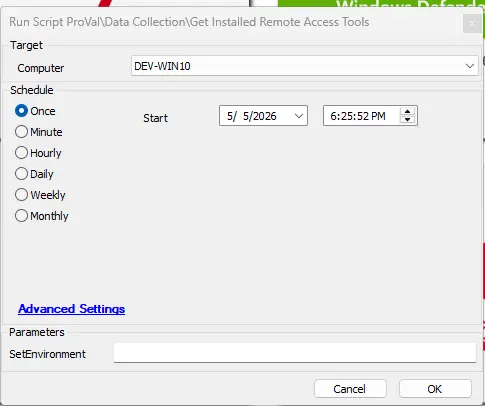

## Summary
This script performs a comprehensive inventory of endpoints to identify a curated set of remote access tools. It analyzes multiple data sources, including uninstall registry keys, active processes, installed services, and known executable paths, to ensure accurate detection.

Optional exclusions can be configured using a System Property, allowing flexibility in tailoring the results.

The collected data is then stored in the custom table [pvl_installed_remote_access_tools](/docs/122991ce-8d88-448b-a4a2-4bde95ccc149) for reporting and further analysis.

Supported tool display names (*use exact spelling when excluding*): 

- `AeroAdmin`
- `Ammyy Admin`
- `AnyDesk`
- `BeyondTrust`
- `Chrome Remote Desktop`
- `ScreenConnect`
- `CW RMM`
- `DWService`
- `GoToMyPC`
- `LiteManager`
- `LogMeIn`
- `ManageEngine`
- `Ninja RMM`
- `NoMachine`
- `Parsec`
- `Remote Utilities`
- `RemotePC`
- `Splashtop`
- `Supremo`
- `TeamViewer`
- `TightVNC`
- `UltraVNC`
- `VNC Connect (RealVNC)`
- `Zoho Assist`
- `Atera`
- `Automate`
- `Datto RMM`
- `Kaseya`
- `N-Able N-Central`
- `N-Able N-Sight`
- `Syncro`

## Dependencies

- [Solution - Installed Remote Access Tools](/docs/e5150f2e-6b8a-4156-9c1b-513e602b36a1)

## Sample Run

  

## User Parameters

| Name | Required | Example | Description   |
|---------|---------|---------|---------|
| SetEnvironment | False | 1 | Set the `SetEnvironment` parameter to `1` during the initial execution of the script to create the system property and required EDFs. |

## System Properties

| Name | Required | Example | Description   |
|---------|---------|---------|---------|
| WhiteListedRemoteAccessTools | False | <ul><li>`Datto RMM, Chrome Remote Desktop, AnyDesk, ScreenConnect Client (3429b39dc0180fcf)`</li><li>`Datto RMM`</li></ul>  | Optional comma-separated list of remote access tool display names that should be excluded from detection. Use this when specific tools are approved for the site and should not be reported by this script. Different ScreenConnect instances can also be excluded by specifying the instance identifier after ScreenConnect Client, for example: `ScreenConnect Client (3429b39dc0180fcf)`. This allows precise exclusion of individual screenconnect instances.  ***Note : The tools defined in this property will be excluded on all client machines.***|

## Extra Data Fields

| EDF Name                              | Level    | Type      | Section | Example  |Description                                                                                                    |
|---------------------------------------|----------|-----------|----------|--------- | ---------------------------------------------------------------------------------------------|
| WhiteListedRemoteAccessTools          | Client   | Text      | Default | <ul><li>`Datto RMM, Chrome Remote Desktop, AnyDesk, ScreenConnect Client (3429b39dc0180fcf)`</li><li>`Datto RMM`</li></ul> | Define Tools name separated by comma to be excluded for a particular client.    |
| WhiteListedRemoteAccessTools          | Location   | Text      | Default | <ul><li>`Datto RMM, Chrome Remote Desktop, AnyDesk, ScreenConnect Client (3429b39dc0180fcf)`</li><li>`Datto RMM`</li></ul> | Define Tools name separated by comma to be excluded for a particular location.     |
| WhiteListedRemoteAccessTools          | Computer   | Text      | Default | <ul><li>`Datto RMM, Chrome Remote Desktop, AnyDesk, ScreenConnect Client (3429b39dc0180fcf)`</li><li>`Datto RMM`</li></ul> | Define Tools name separated by comma to be excluded for a particular machine.     |

**Note :** `If tools are whitelisted at the system property, client, location, or machine level, the script will consolidate all entries and whitelist the combined set of tools.`

## Output

- Script Logs
- Custom table

## Changelog

### 2026-05-15

- Updated Powershell to  display individual ScreenConnect instances instead of simply listing ConnectWise Control and to also detect CW RMM if present on the machine.
- Introduced Client, Location, and Computer-level EDFs to allow whitelisting at different levels.
- Added CW RMM to the list.

### 2026-05-05

- Initial version of the document
