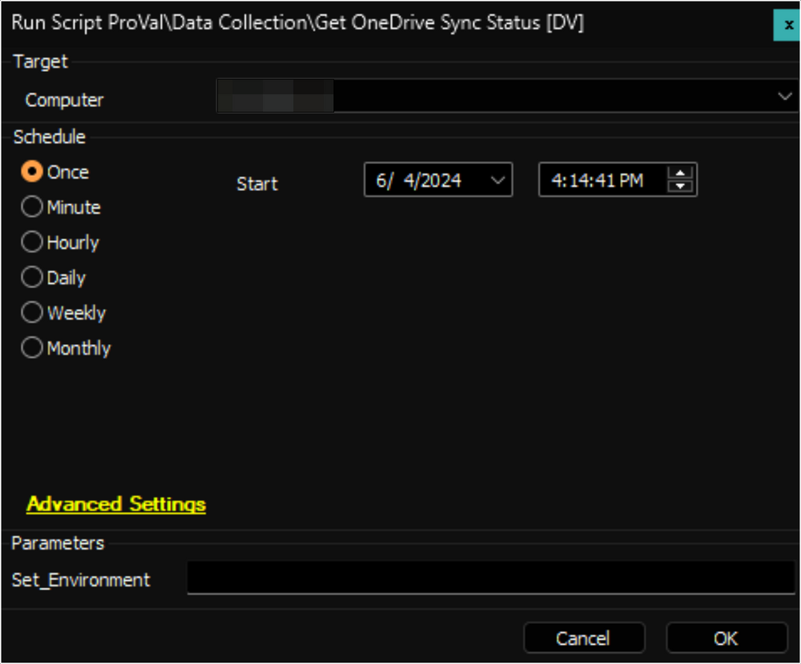
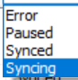

## Summary

The script employs the [Get-ODStatus.ps1](https://github.com/rodneyviana/ODSyncUtil/blob/master/ODSyncUtil/Get-ODStatus.ps1) script to retrieve the OneDrive Sync Status and Quota Information. This data is then stored in a custom table. A user must be logged on to the machine to use the script.

## Sample Run

**First Run:** Run the script against any online Windows machine with the `Set_Environment` parameter set to `1` to create the custom table [pvl_odsync_status](/docs/e7a826db-104c-4ebb-877f-b44e138067f9).

**Regular Execution:**  

## User Parameters

| Name             | Example | Required                | Description                                                                                                                                                       |
|------------------|---------|-------------------------|-------------------------------------------------------------------------------------------------------------------------------------------------------------------|
| Set_Environment   | 1       | For First Execution      | Run the script against any online Windows machine with the `Set_Environment` parameter set to `1` to create the custom table [pvl_odsync_status](/docs/e7a826db-104c-4ebb-877f-b44e138067f9). |

## Output

- Custom Table  
- Dataview
- Script Log

## FAQ

1. Does the OneDrive Sync Status in the [Dataview - OneDrive Sync Status [Script]](/docs/61160125-8794-4e01-ba0a-3bf4ec81077e) contain the data for the OneDrive Sync or Script?  
   **Answer:** The data in the OneDrive Sync Status is the OneDrive Sync data, not the script data.  
   

2. Can this script be run in an environment where a security application is applied?  
   **Answer:** Yes, you just need to whitelist the following hashes:  
   - C:/ProgramData/_Automation/Script/ODSync/ODSyncUtility.ps1: **A5EBD70394BA53B0D3A093FB47C94985**  
   - C:/ProgramData/_Automation/Script/ODSyncUtil/ODSyncFetch.ps1: **4626F936E0BABCE79F350E096671A19F**  

