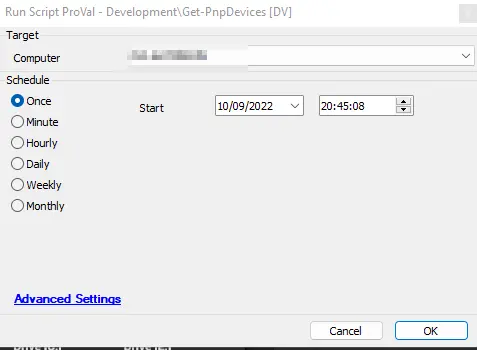

## Summary

This script will collect information about the installed [PnP Devices](https://docs.microsoft.com/en-us/windows-hardware/drivers/kernel/introduction-to-plug-and-play) and store it in the custom table [Plugin_ProVal_PnpDevices](/docs/d0d38e82-7faf-4e0f-86b3-81b01a9f18fb).

**Intended Target:** Windows Computers

## Sample Run

## Dependencies

- [CWM - Automate - Dataview - Get-PNPDevices [Script]](/docs/f0f7231c-f13b-46a0-baa6-aebb8640adaf)
- [CWM - Automate - Solution - PnP Devices Inventory](/docs/f92a5e4c-9ade-4cb9-ba9f-4e8b7d6ae0da)
- [CWM - Automate - Custom Table - plugin_proval_pnpdevices](/docs/d0d38e82-7faf-4e0f-86b3-81b01a9f18fb)

## Variables

| Name            | Description                                                                                       |
|-----------------|---------------------------------------------------------------------------------------------------|
| InsertStatement | Result of the PowerShell script that attempts to retrieve the [PnP Devices](https://docs.microsoft.com/en-us/windows-hardware/drivers/kernel/introduction-to-plug-and-play) information |

## Process

1. Create the [Plugin_ProVal_PnpDevices](/docs/d0d38e82-7faf-4e0f-86b3-81b01a9f18fb) table if it does not already exist.
2. Run the PowerShell script to retrieve information about installed [PnP Devices](https://docs.microsoft.com/en-us/windows-hardware/drivers/kernel/introduction-to-plug-and-play).
3. Verify the outcome.
4. Parse the outcome to ensure SQL compatibility.
5. Insert the data into the [Plugin_ProVal_PnpDevices](/docs/d0d38e82-7faf-4e0f-86b3-81b01a9f18fb) table.
6. Log any failures.

## Output

- Script Log
- Dataview