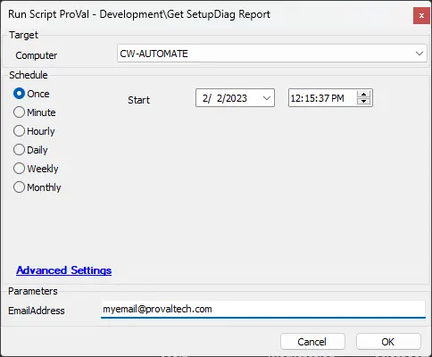

## Summary

Download (if necessary) and execute [SetupDiag.exe](https://learn.microsoft.com/en-us/windows/deployment/upgrade/setupdiag), returning the results to a variable and optionally emailing them.

## Sample Run

## Dependencies

- [Invoke-SetupDiag](/docs/43e03fcc-e736-4d19-b231-76403f71c4e2)

## Variables

| Name              | Description                               |
|-------------------|-------------------------------------------|
| SetupDiagResult   | Contains the return from the run of SetupDiag. |

### User Parameters

| Name          | Example                                   | Required | Description                                   |
|---------------|-------------------------------------------|----------|-----------------------------------------------|
| EmailAddress  | [myemail@provaltech.com](mailto:myemail@provaltech.com) | False    | Send an email report to a specified address. |

## Output

Outputs to a variable (`SetupDiagResult`) that can be referenced in parent scripts.

See [Invoke-SetupDiag](/docs/43e03fcc-e736-4d19-b231-76403f71c4e2) for additional output information.