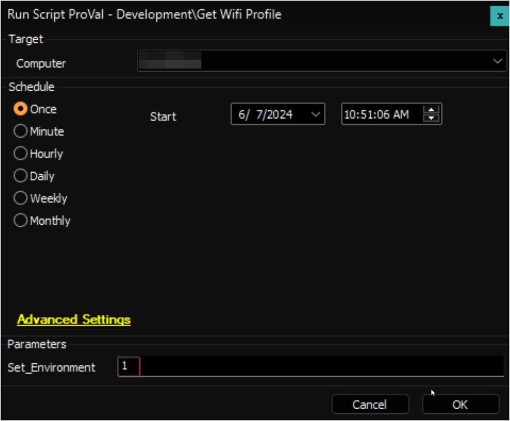

## Summary

The script is an Automate implementation of the agnostic script [Get-WifiProfile](/docs/478f97f0-d069-4f50-9b93-2c9ca9ec63cd). It retrieves details about Wi-Fi profiles stored on designated end-user machines.

## Sample Run

- For the first execution of the script, the value of the user parameter `Set_Environment` should be set to `1`. This will create the EDF, System property, and [custom table](/docs/cffbdce7-7390-4b11-9300-6a34799b7d82) solution:  
    

- Regular execution:  
    

## Variables

| Name               | Description                                          |
|--------------------|------------------------------------------------------|
| ProjectName        | Get-WifiProfile                                      |
| WorkingDirectory    | C:/ProgramData/_Automation/Script/Get-WifiProfile   |
| PS1Log             | C:/ProgramData/_Automation/Script/Get-WifiProfile-Log.txt |
| PS1ErrorLog        | C:/ProgramData/_Automation/Script/Get-WifiProfile-Error.txt |
| TableName          | [pvl_wifi_profiles](/docs/f317da6e-0ea2-4c1e-bad9-4d0ad25684d3) |

#### User Parameters

| Name               | Example | Required              | Description                                                                 |
|--------------------|---------|-----------------------|-----------------------------------------------------------------------------|
| Set_Environment     | 1       | True for the first run | It is mandatory to set this parameter to 1 for the very first execution of the script. |

## Output

- Script Log
- Dataview

