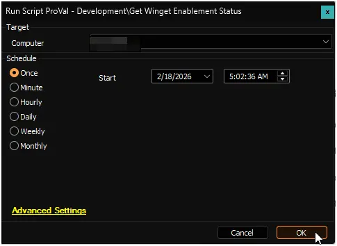

## Summary

The script checks whether Winget is enabled and available on Windows machines. A user must be logged in for the script to run.

## Sample Run

## Dependencies

- [Solution: Winget Enablement Status](/docs/7d348f5c-3c23-4efb-b402-0ffba0492117)

## EDFs

| Name | Level | Section | Type | Description |
| ---- | ----- | ------- | ---- | ----------- |
| Winget Enablement Status | Computer | Winget | Text | Stores the enablement status returned by the script. |
| Winget Enablement Data Collection Time | Computer | Winget | Text | Stores data collection time. |

## Output

- Script Logs
- EDF
- Dataview
