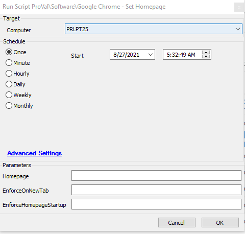

## Summary

This script takes a string parameter to define the URL to set the homepage and adds the registry policy for an enforced homepage in Google Chrome.

**Time Saved by Automation:** 5 Minutes

## Sample Run

## Dependencies

- Windows 10 1703+
- Google Chrome 86+
- [Set-ChromeHomepage](/docs/f07dd124-b64e-4906-8f33-5a2109ac73ab)

## Variables

- `@PS1DataLog@` - Helps to verify if the script actually succeeded.
- `@PS1ErrorLog@` - Helps to track failures of the script.

#### User Parameters

| Name                       | Example                     | Required | Description                                                                                  |
|----------------------------|-----------------------------|----------|----------------------------------------------------------------------------------------------|
| `-Homepage`                | [www.google.com](http://www.google.com) | True     | The string value of the homepage to set in the browser.                                     |
| `-EnforceOnNewTab`        |                             | False    | Include this switch to force the homepage on each new tab instead of the new tab page.     |
| `-EnforceHomepageStartup`  |                             | False    | Include this switch to force the homepage to be the only open tab at startup of the browser. |

## Process

The script takes a string parameter to define the URL to set the homepage. The applicable registry policies are applied to set the homepage to the one defined by the parameter. Optionally, switches can be used to enforce the homepage on startup and to enforce the homepage on each new tab.

## Output

- Script log
- Local file on computer

