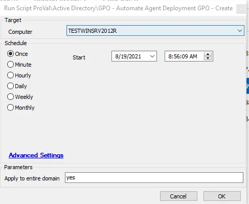

## Summary

This script runs against a domain controller in a location with a network probe configured. It builds a GPO that deploys the Automate Agent. The script can be run to either link or not link the GPO to the root domain.

**Time Saved by Automation:** 5 Minutes

## Sample Run

## Dependencies

- Network Probe setup on the domain controller

## Variables

- `@Credentials@` - For verification of location credentials
- `@powershellresult@` - Used for verification of PowerShell 2.0 on the machine
- `@LTSilentEXEURL@` - Used for verification of the probe machine.

#### User Parameters

| Name                    | Example | Required | Description                                                                 |
|-------------------------|---------|----------|-----------------------------------------------------------------------------|
| Apply to entire domain  | yes     | True     | Here you can define whether you want to enforce the GPO to the entire domain or not |

## Process

- Verifies the admin credentials set on the location
- Verifies whether the PowerShell version on the machine is greater than 2.0
- Retrieves the URL to download the location-specific silent EXE from the probe system
- Downloads: GPO Backup, EXE, Startup script
- Stores the EXE and backup in `C:/Windows/SYSVOL/domain/scripts/`
- Edits the migration table for the GPO
- Imports the GPO using the edited migration table

## Output

- Script log