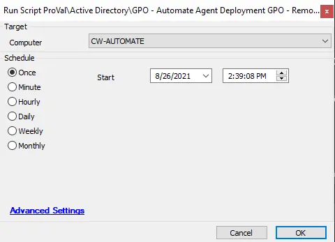

## Summary

This script will remove the "Automate Agent Deployment" group policy from the Domain Controller (DC) server.

**Time Saved by Automation:** 10 Minutes

## Sample Run

## Process

The script runs the appropriate PowerShell command to remove the "Automate Agent Deployment" GPO from the target DC.

## Output

- Script log