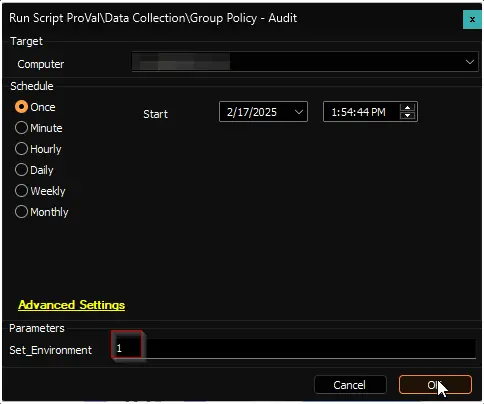
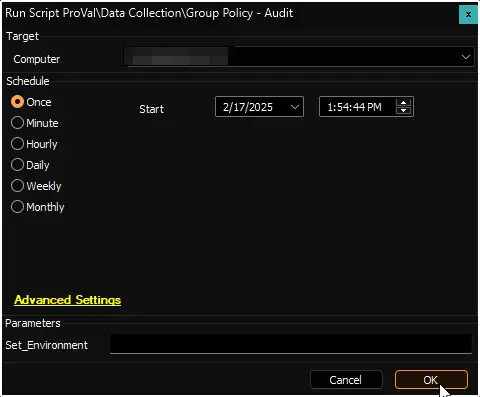

## Summary

This document outlines the implementation of the agnostic script [Start-GPOAudit](/docs/b070c950-2727-48b3-9226-84468960ee85) within ConnectWise Automate.

## File Hash

**File Path:** `C:/ProgramData/_Automation/script/Start-GPOAudit/Start-GPOAudit-AI.ps1`  
**File Hash (Sha256):** `D6D29BF83E1B81ABD1863D37317133C4963747511213E409B48F256CD3137198`  
**File Hash (MD5):** `6577853984D3FD1FB34474D97522A5D4`  

## Sample Run

**First Execution:** Execute the script against any online Windows computer with the `Set_Environment` parameter set to `1`. This will create the following necessary tables:

- [plugin_proval_ad_gpo](/docs/c7cf649a-dd80-4e9d-8c80-eb95b813b7c9)
- [plugin_proval_ad_gp](/docs/0e873ec4-0fcc-4131-bf33-1f74f8b28c80)
- [plugin_proval_ad_gpolinks](/docs/85f52c7c-84bc-488f-a4de-d3122fec1f42)
- [plugin_proval_ad_gposf](/docs/8fa8c78e-04a4-4495-8cfe-44aef7b48035)

**Regular Execution:**  

## Dependencies

- [Start-GPOAudit](/docs/b070c950-2727-48b3-9226-84468960ee85)
- [OverFlowedVariable - SQL Insert - Execute](/docs/34cee8fe-1b6b-4558-a890-2face427ceb8)

## Output

- Custom Table
- Dataview
- Script Log