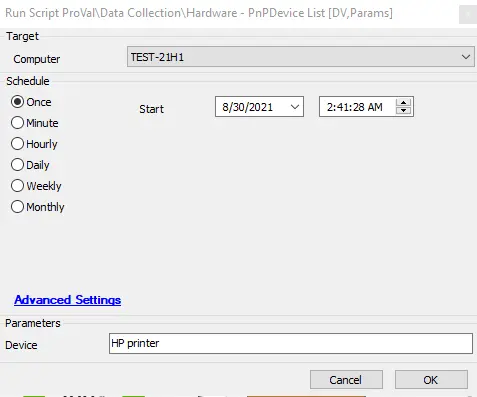

## Summary

This script collects the device name and version information as provided for the parameter “Device” while executing the script.

**Time Saved by Automation:** 15 Minutes

## Sample Run

## Dependencies

@Hardware - PnPDevice List Script

## Variables

| Variable Name | Description                                                                                               |
| ------------- | --------------------------------------------------------------------------------------------------------- |
| NameLoop      | This variable will hold the result of the SQL query `SELECT CONCAT('@','DriverVersion',@loopcounter,'@')` |
| DriverLoop    | This variable will hold the result of the SQL query `SELECT CONCAT('@','DriverVersion',@loopcounter,'@')` |

### Global Parameters

| Name   | Example    | Required | Description                                                                                                           |
| ------ | ---------- | -------- | --------------------------------------------------------------------------------------------------------------------- |
| Device | HP Printer | True     | Provide the device name for which you need version information on all of your Windows agents to show in the Dataview. |

## Script States

| Script State Name         | Description                                                             |
| ------------------------- | ----------------------------------------------------------------------- |
| `DeviceList@loopcounter@` | This script state will hold the `@NameLoop@` and `@DriverLoop@` values. |

## Process

This script collects information about the device name and version as provided for the parameter “Device” while executing the script. The script runs PowerShell to get the device name and device version, splits the variables, and then runs the SQL commands to get the results, holding them in the script state.

## Output

- Dataview