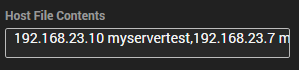

## Summary

This script takes user parameters when running the script and places them inside the host file of the machine. Both parameters are required for the script to function properly.

## Sample Run

## Dependencies

This script is dependent on the following items:
- [EPM - Windows Configuration - Script - Hosts File - Audit](/docs/19d3cc45-e5bd-4705-b82d-c0657b2e6195)
- Host File Contents (Extra Data Field)

#### User Parameters

| Name      | Example               | Required | Description                                                                                                                                          |
|-----------|-----------------------|----------|------------------------------------------------------------------------------------------------------------------------------------------------------|
| DNSName   | Server01 OR svr1 svr2 | True     | This depicts what DNS host name you would like linked to the IP address set when running the script. Multiple DNS names can be specified, separated by a space. |
| IPaddress | 192.168.23.10        | True     | This depicts what IP address you would like linked to the DNS host name set when running the script. (Only one IP address can be specified per run of this script) |

## Process

1. Scan the current host file and ensure the DNS name set in the user parameters is not already located in the host file.
2. Rename the current host file with "OLD" in the name.
3. Rebuild the host file using the contents of the old host file and append the new line at the bottom.
4. Perform an `ipconfig /flushdns`.
5. Update the EDF with the current data.

## Output

This script outputs information to the following areas:
- Script Log
- Host File Contents (Extra Data Field)
  -  OR 

