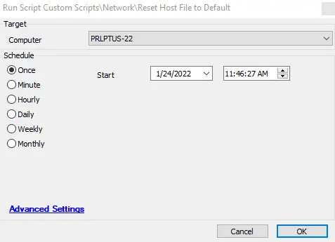

## Summary

This script simply renames the current host file to include OLD in the name and replaces it with a stock host file that contains no custom entries.

## Sample Run

## Dependencies

This script depends on the following items:
- [Update EDF with Existing Host File Entries](/docs/19d3cc45-e5bd-4705-b82d-c0657b2e6195)
- Host File Contents (Extra Data Field)

## Process

1. Rename the existing host file to include OLD in the name.
2. Build a new host file with the default host file information.
3. Perform `ipconfig /flushdns`.
4. Update the Host File Contents EDF with the new information.

## Output

This script outputs information to the following areas:
- Script Log
- Host File Contents EDF
  - 