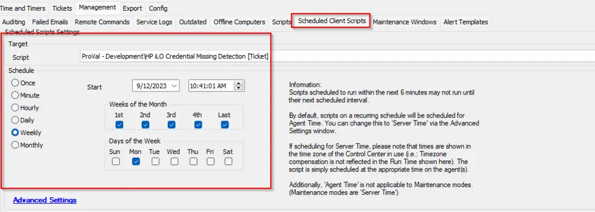

## Summary

This is a client script that creates tickets for all clients who have an HP Server with HP iLO enabled but are missing credentials.

Flag the Computer-Level EDF `Exclude From HPE iLO Monitoring` to exclude a computer/server from generating a ticket.

## Sample Run

## Dependencies

- [Solution - HP iLO Health Check](/docs/7bd9dad1-d463-468b-a3b1-2eef8e060352)

## Implementation

- Import the script.
- After importing, please reload the system cache and refresh the scripts to have the EDF automatically imported with the script.
- Schedule it from the dashboard -> Scheduled Client Scripts.  
  Note: This is an optional feature. Please ensure the client wants ticketing for the missing credentials alerting.

## Output

- Script log
- Ticket