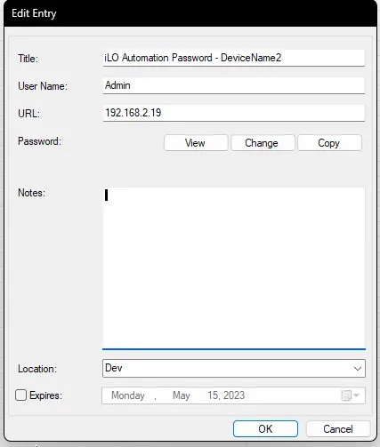
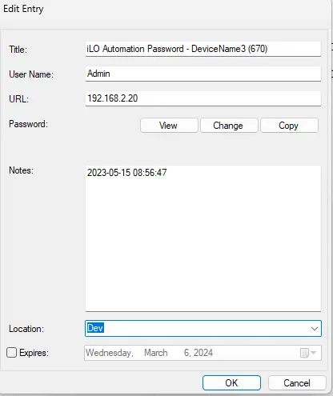
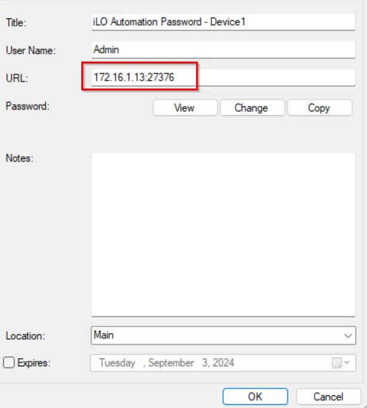
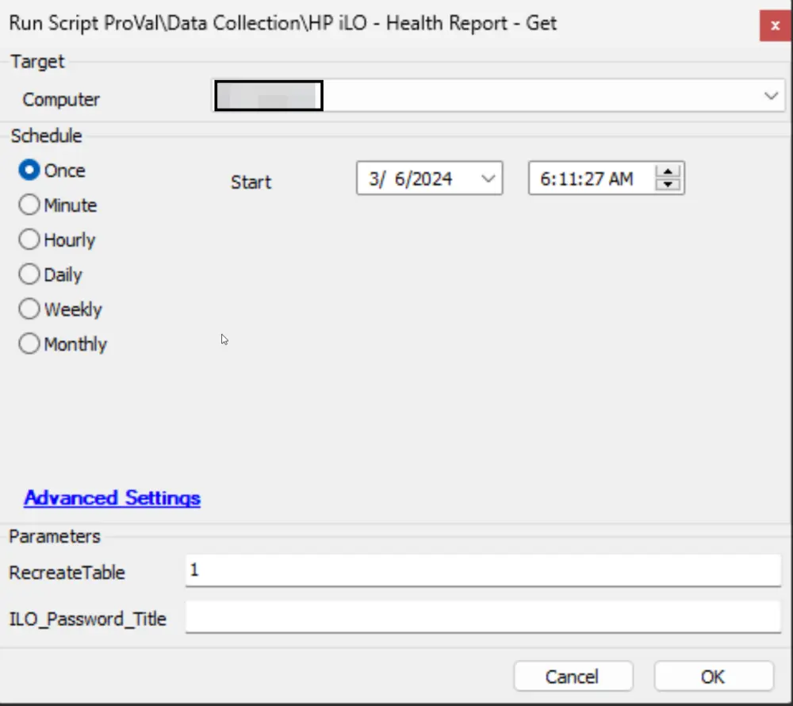
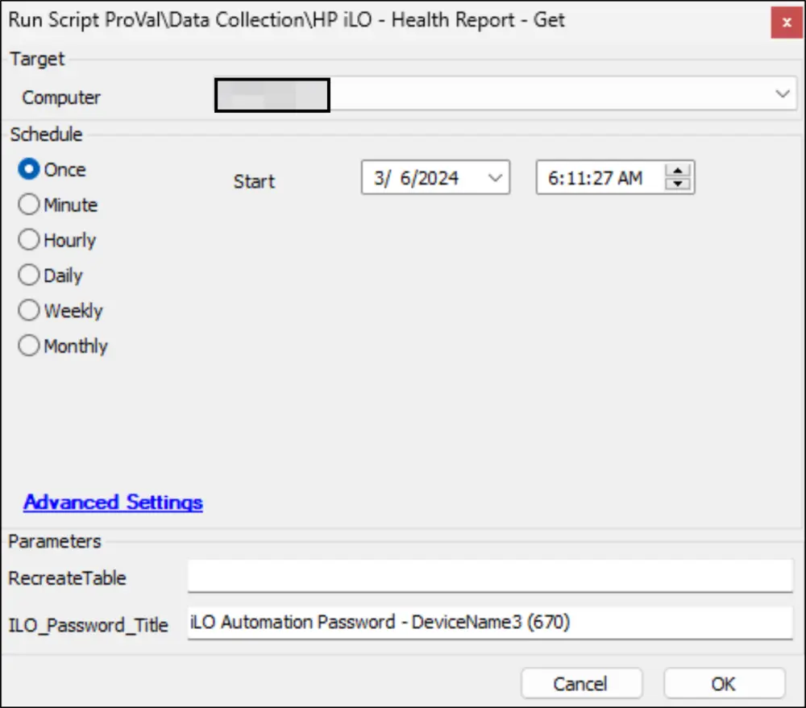
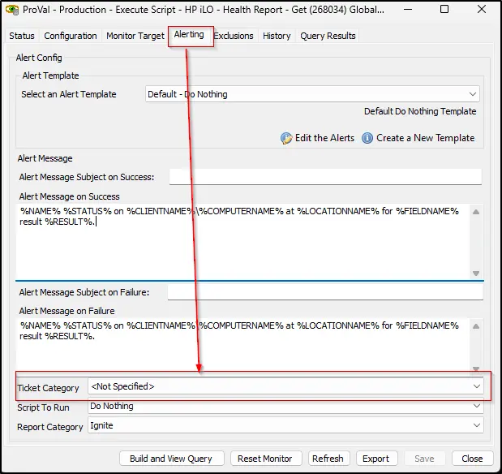

## Summary

Retrieve an iLO health report using the provided IP address. It is required to have a password entry saved in the client-level passwords section to utilize this script. The password should be saved following the instructions outlined in the **Client Level Password Entry** section of this document.

## Requirements

- PowerShell v5
- Desktop edition of PowerShell
- PowerShellGet 2.0+ (The script will attempt to update the PowerShellGet version if it's older)
- .NET Runtime 4.7.2+
- iLO Version 3+

## Client Level Password Entry

The `Title` for the password entry saved for the iLO Device should be in the following format:

- **iLO Automation Password - /\<iLO Device Name/>**

  Example: `iLO Automation Password - DeviceName2`; When saving the password in this format, the [CWM - Automate - Internal Monitor - Execute Script - HP iLO - Health Report - Get](/docs/a8f66140-8915-41fa-805b-64fafbf002fc) monitor set will execute the script against any random computer from the network of the IP Address stored in the `URL` field to fetch the information for the iLO Device `DeviceName2`.

  It is recommended to utilize this method for saving the password. The second method should be reserved for situations where unique networking configurations restrict other devices from accessing the iLO.

  

- **iLO Automation Password - /\<iLO Device Name/> (/\<Computer ID to connect to the device/>)**

  Example: `iLO Automation Password - DeviceName3 (670)`; When saving the password in this format, the [CWM - Automate - Internal Monitor - Execute Script - HP iLO - Health Report - Get](/docs/a8f66140-8915-41fa-805b-64fafbf002fc) monitor set will execute the script against the computer ID 670 to fetch the information for the iLO Device `DeviceName3` with the IP Address stored in the password's `URL` field.

  

  **Note:** If the iLO IP is bound to a port, it is mandatory to provide the IP with its port in the URL section of the password tab. This applies to both options.

  Please refer to the screenshot:

  

  **Warning:** Notes should not be added manually; the script stores the last run time in the Notes of the password entry.

## Sample Run

**RecreateTable:** Set the value to 1 to recreate the [plugin_proval_ilo_health_report](/docs/d6e5e2a7-ecb8-4262-92a1-cc322b4af3b6) table. It is suggested to run the script for the first time with 1 for this parameter.

**ILO_Password_Title:** Title of the password entry stored at the client level to reach the iLO Device.

**Note:** Both parameters cannot be used together.

## Dependencies

[CWM - Automate - Internal Monitor - Execute Script - HP iLO - Health Report - Get](/docs/a8f66140-8915-41fa-805b-64fafbf002fc)

## Variables

| Name       | Description                                                                                          |
|------------|------------------------------------------------------------------------------------------------------|
| PasswordID | The password ID of the password table entry with the title of `@PasswordTitle@`.                   |
| Username   | The username of the password table entry with the title of `@PasswordTitle@`.                       |
| Password   | The password of the password table entry with the title of `@PasswordTitle@`.                       |
| Subject    | Ticket Subject                                                                                       |
| Body       | Ticket Body                                                                                          |
| Tickid     | Ticket ID of the existing ticket to comment. The script will create a new ticket only when an open/new ticket does not exist for the failure. |

## Global Parameters

| Name          | Example                      | Required | Description                                                                                                           |
|---------------|------------------------------|----------|-----------------------------------------------------------------------------------------------------------------------|
| PasswordTitle | iLO Automation Password       | True     | This title should not be changed as the internal monitor [CWM - Automate - Internal Monitor - Execute Script - HP iLO - Health Report - Get](/docs/a8f66140-8915-41fa-805b-64fafbf002fc) depends on it. This password entry can be set either at the client or location level. |

## User Parameters

| Name              | Example                     | Required | Description                                                                                                                                                                                           |
|-------------------|-----------------------------|----------|-------------------------------------------------------------------------------------------------------------------------------------------------------------------------------------------------------|
| ILO_Password_Title| HPILO Password - DeviceName | True     | To override the value of the global parameter `PasswordTitle`. If this parameter is set, the script will utilize the password title supplied by this parameter rather than the one saved in the global parameter. This password entry can be saved either at the client level as the script target. |
| Recreate Table     | 0 or 1                     | False    | Set the value to 1 to recreate the [plugin_proval_ilo_health_report](/docs/d6e5e2a7-ecb8-4262-92a1-cc322b4af3b6) table. It is suggested to run the script for the first time with 1 for this parameter. Recreating the table will remove the existing information from the table if it already exists. |

## Output

- Script log
- Local file on computer
- Dataview
- Ticket

## Ticketing

The script is capable of generating tickets for five distinct failures. However, it will only create tickets at the client level. The ticketing feature of the script can be enabled by setting the ticket category in the [CWM - Automate - Internal Monitor - Execute Script - HP iLO - Health Report - Get](/docs/a8f66140-8915-41fa-805b-64fafbf002fc) monitor set.

**Subject:** `HP iLO - Health Report - Get Script - Failed - %ClientName%`

1. Computer is unable to reach [file.provaltech.com](http://file.provaltech.com) and download the script  
   **Body:** Computer %computername% is unable to reach the file server to download the script. Please ensure that the machine is reachable at [https://file.provaltech.com](https://file.provaltech.com) and rerun the script.

2. The PowerShell script returned an error/failure  
   **Body:** The script encountered an error when running the process.  
   PowerShell script Result: @psout@  
   Script Logs: @LogContent@  
   The script was executed against %ComputerName% (%Computerid%)

3. Script returned a 401 unauthorized error, indicating a credentials problem  
   **Body:** A 401 Unauthorized error was thrown when attempting to authenticate with the iLO at @Address@. Please review the password at client %clientname% named '@PasswordTitle@' to ensure that the correct password is being used.

4. PowerShell script fails to update the PowerShellGet Module  
   **Body:** The script encountered an error when trying to update the PowerShellGet Module.  
   Script Output: @PowerShellGet@  
   The script was executed against %ComputerName% (%Computerid%)

5. If the script is executed by the internal monitor and the computer ID is not specified in the password entry or the monitor set cannot locate any online computer on the client's network that matches the network of the IP address specified in the `URL` field of the password entry for the HP iLO device.  
   **Body:** Unable to find a computer online at %clientname% within the network(s) @Network@. Automate will not be able to gather details for the HP iLO device(s) based on the provided password entry(ies) @Title@.
