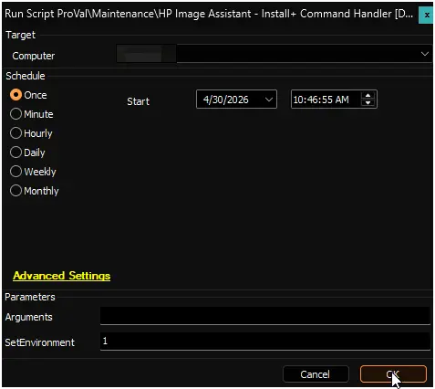
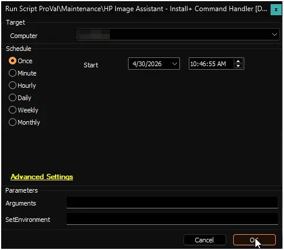
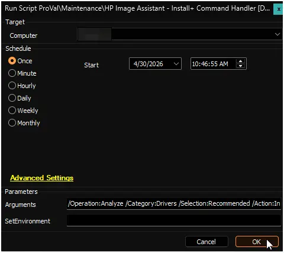
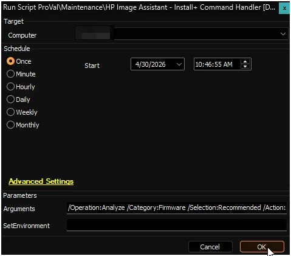
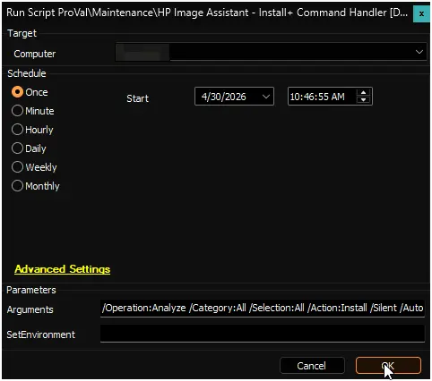

## Summary

The [HP Image Assistant (HPIA)](https://ftp.ext.hp.com/pub/caps-softpaq/cmit/HPIA.html) application is used by this script to manage and carry out updates on HP Workstations. If the application isn't already installed, it will be automatically installed from Winget.
This script provides the feature to perform an HP Image Assistant scanning audit to list available updates if no arguments are passed, or it can execute specific update actions (such as installing drivers, software, or firmware) if arguments are passed.

**Supported OS:** Windows 10, Windows 11

**Supported commands/arguments reference:**  
[HP Image Assistant User Guide](https://ftp.hp.com/pub/caps-softpaq/cmit/imagepal/userguide/936944-005.pdf)

**Note:**

1. The systems must be [compatible HP hardware](https://ftp.ext.hp.com/pub/caps-softpaq/cmit/imagepal/ref/platformList.html). The script will automatically validate the manufacturer and product ID against HP's official platform compatibility list before proceeding.  
2. ProVal does not recommend performing BIOS updates remotely. ProVal is not responsible for any failed devices due to remote BIOS updates. BIOS updates are performed at the MSP's risk.

## Dependencies

- [PowerShell: Initialize-HPImageAssistant](/docs/92b749f0-2e30-4d4d-8916-fb5f30d85bff)
- [Custom Table: pvl_hpimageassistant_audit](/docs/d41f1905-bc6a-412f-9de9-88010c502010)
- [Script: OverFlowedVariable - SQL Insert - Execute](/docs/34cee8fe-1b6b-4558-a890-2face427ceb8)
- [Solution: HP Image Assistant Handler](/docs/ddf20590-a18c-43f2-9e14-4ce2606187bc)

## Sample Run

Run the script with the `SetEnvironment` parameter set to `1` after import to get the required EDFs imported for the HP Image Assistant scanning and exclusions. It will also create the custom table [pvl_hpimageassistant_audit](/docs/d41f1905-bc6a-412f-9de9-88010c502010).

  

**Example 1:**

Running the script without passing arguments to perform a default scan and return the available updates.  
**Arguments:** `<Blank>`  
  

**Example 2:**

Running the script to silently install recommended `driver` updates.  
**Arguments:** `/Operation:Analyze /Category:Drivers /Selection:Recommended /Action:Install /Silent /AutoCleanup /ReportFilePath:"C:\ProgramData\_Automation\App\HPImageAssistant\InstallReport"`  
  

**Example 3:**

Running the script to silently install recommended `firmware` updates.  
**Arguments:** `/Operation:Analyze /Category:Firmware /Selection:Recommended /Action:Install /Silent /AutoCleanup /ReportFilePath:"C:\ProgramData\_Automation\App\HPImageAssistant\InstallReport"`  
  

**Example 4:**

Running the script to silently install all available updates (drivers, firmware, and software) in one pass.  
**Arguments:** `/Operation:Analyze /Category:All /Selection:All /Action:Install /Silent /AutoCleanup /ReportFilePath:"C:\ProgramData\_Automation\App\HPImageAssistant\InstallReport"`  
  

## User Parameters

| Name     | Example | Required | Description                                                                                                                                                                                                                                         |
|----------|---------|----------|-----------------------------------------------------------------------------------------------------------------------------------------------------------------------------------------------------------------------------------------------------|
| `SetEnvironment`            | `1`               | `First Run Only`      | If set to `1`, it will import the required EDFs for the HP Image Assistant scanning and exclusions, and it will also create the custom table [pvl_hpimageassistant_audit](/docs/d41f1905-bc6a-412f-9de9-88010c502010).           |
| `Arguments`  | <ul><li>`<Blank>`</li><li>`/Operation:Analyze /Category:Drivers /Selection:Recommended /Action:Install /Silent /AutoCleanup`</li><li>`/Operation:Analyze /Category:Firmware /Selection:Recommended /Action:Install /Silent /AutoCleanup`</li><li>`/Operation:Analyze /Category:All /Selection:All /Action:Install /Silent /AutoCleanup`</li></ul>   | `False`    | Command arguments to execute on the computer; a scan to list available updates will be executed if this parameter is left blank.   **Reference:** [HP Image Assistant User Guide](https://ftp.hp.com/pub/caps-softpaq/cmit/imagepal/userguide/936944-005.pdf) |

## Global Variables

| Name  | Example | Required | Description |
| ----- | ------- | -------- | ----------- |
| `Debug` | <ul><li>`False`</li><li>`True`</li></ul>   | False    | When `True`, enables informational logging; when `False` (default), informational logs are suppressed to avoid adding entries to the `h_scripts` table. Set to `True` to assist with troubleshooting. |

## EDFs

| Name | Type | Level | Section | Required | Editable | Description |
| ---------------- | -------- | -------- | ------- | ------- | ------- | --------------------------------------------------------------------------- |
| HP Image Assistant Update Audit | Checkbox | Client | HP  | True | Yes | This EDF is required to be selected for the automated deployment of the HP Image Assistant scanning on the HP Windows machines. |
| Exclude HP Image Assistant Scan | Checkbox | Location | Exclusions  | False | Yes | If this EDF is checked, the agents of the location will be excluded from the HP Image Assistant scanning. |
| Exclude HP Image Assistant Scan | Checkbox | Computer |  Exclusions | False | Yes | If this EDF is checked, the agent will be excluded from the HP Image Assistant scanning. |

## Output

- Script Log
- [Custom Table: pvl_hpimageassistant_audit](/docs/d41f1905-bc6a-412f-9de9-88010c502010)
- [Dataview: HP Image Assistant Audit](/docs/fdad852c-49cf-4b8a-b638-0386989e3039)

## Changelog

### 2026-04-30

- Initial version of the document.
