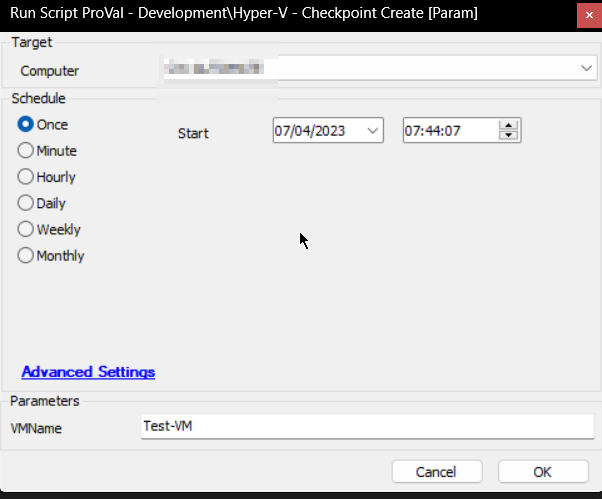

## Summary

The script can be used to create a checkpoint of a virtual machine hosted on a Hyper-V Host Server.

**Intended Target:** Hyper-V Host Server

**Checkpoint Name:** `Checkpoint_$(Get-Date -Format 'yyyyMMdd_HHmmss')`  
**Example:** Checkpoint_20230407_063842

## Sample Run

## Variables

| Name             | Description                                           |
|------------------|-------------------------------------------------------|
| ProjectName      | HyperV_Checkpoint                                    |
| WorkingDirectory  | C:/ProgramData/_automation/script/HyperV_Checkpoint  |
| ShellResult      | Output of the PowerShell script creating the checkpoint |

### User Parameters

| Name   | Example   | Required | Description                                          |
|--------|-----------|----------|------------------------------------------------------|
| VMName | Test-VM   | True     | Name of the virtual machine for which to create the checkpoint |

## Output

- Script logs

